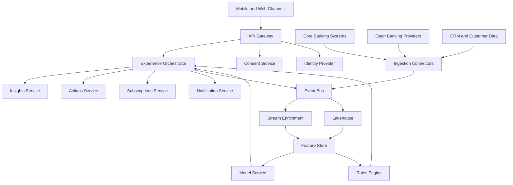
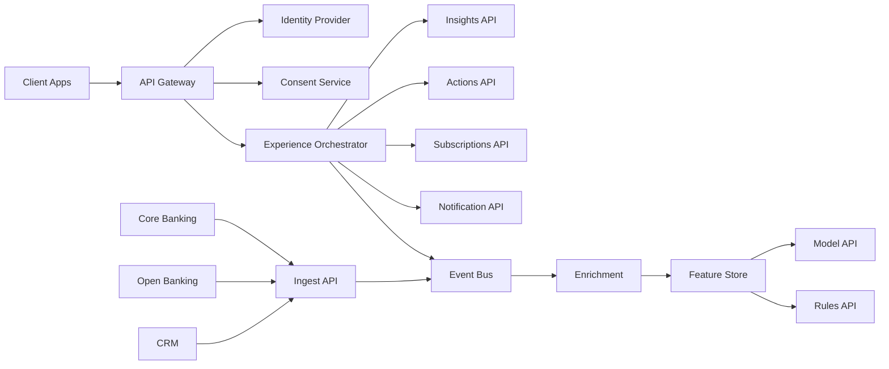

# Hyper-Personalized Retail Banking Experience v2

## 1. Problem Statement
Current banking apps are reactive, generic, and fragmented. Customers often receive late warnings, limited financial coaching, and little context around spending, subscriptions, or upcoming cashflow issues. Although banks already hold rich customer and transaction data, that data is underused and not connected into timely, event-driven experiences.

Customers now expect proactive, personalized support based on their age group, spending habits, subscriptions, and financial behavior. They want precise insights, early warnings, and relevant nudges through channels they already use.

This gap has measurable business impact:
- 67% of customers face at least one monthly financial surprise.
- 30% do not receive early warning on upcoming issues.
- GBP 1.4 billion is lost each year to forgotten subscriptions.
- 57% of Gen Z prefer apps that coach them rather than simply inform them.

If banks fail to respond, they risk higher support volumes, weaker engagement, and customer churn to more adaptive competitors. In a fast-changing UK banking market, a rapid turnaround is required to protect the existing base and attract newer segments such as Gen Z.

## 2. Conceptual Diagram

## 3. Interface Diagram

## 4. API Surface
- `GET /v1/users/{id}/insights`
  Returns personalized insights with message, reason, severity, and confidence.

- `GET /v1/users/{id}/cashflow/forecast`
  Returns a short-term cashflow prediction and upcoming risk indicators.

- `GET /v1/users/{id}/subscriptions`
  Returns detected recurring payments, renewal patterns, and risk flags.

- `POST /v1/users/{id}/subscriptions/{subscriptionId}/cancel`
  Starts a subscription cancellation or partner handoff flow.

- `POST /v1/users/{id}/actions/transfer`
  Moves funds between eligible accounts to reduce shortfall risk.

- `GET /v1/users/{id}/notifications`
  Returns notification history across push, in-app, and email.

- `POST /v1/consents`
  Creates or updates customer consent for personalization, channels, and data usage.

- `GET /v1/consents/{consentId}`
  Returns consent scope, status, and audit metadata.
