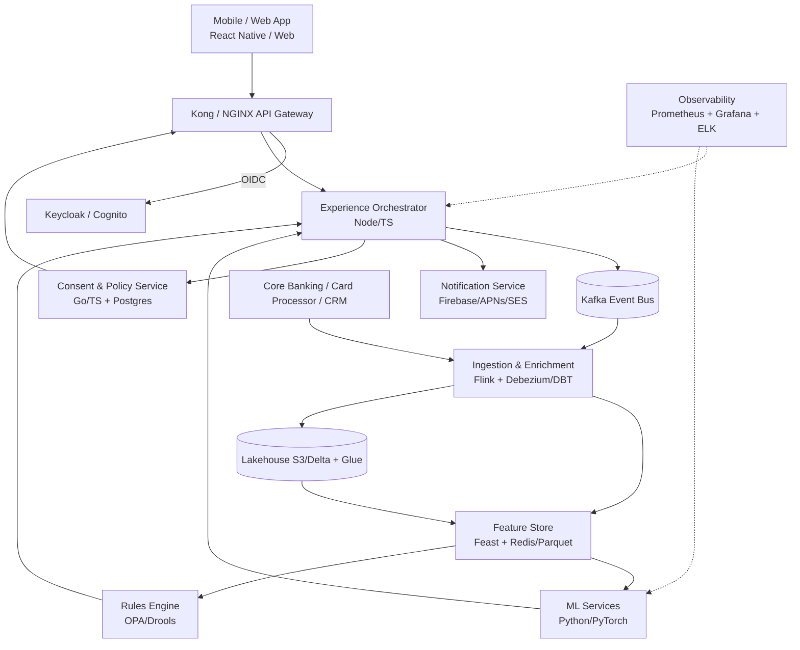
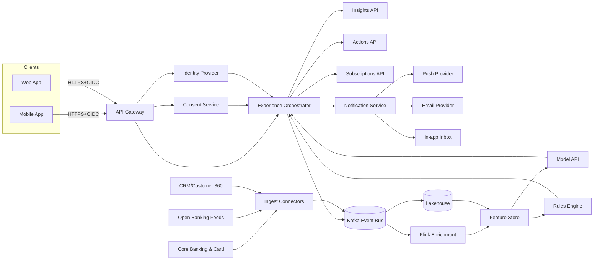

# Hyper-Personalized Retail Banking Experience

## Deliverables (per brief)
- Problem statement (Section 1)
- Conceptual architecture with diagram (Section 7)
- Data flow overview (Section 8)
- Early API surface outline (Section 9)
- Draft consent flow (Section 10)
- Initial non-functional requirements list (Section 11)

## 1. Problem Summary
Customers get generic insights, late warnings, and little coaching. Banks hold rich data, but it is fragmented and not turned into timely, contextual, event-driven experiences. This causes financial surprises, forgotten subscriptions, and churn—especially among Gen Z who expect proactive coaching.

## 2. Goals & Success Measures
- Reduce unexpected-transaction surprises and unplanned balance issues.
- Detect and surface dormant/duplicate/expiring subscriptions before renewal.
- Provide predictive cashflow and personalized nudges tied to spending habits and life stage.
- Improve customer satisfaction (NPS/CSAT), retention, and lower support calls.
- Regulatory alignment: UK GDPR, PSD2/Open Banking, FCA guidance for fair outcomes.

## 3. Staged Approach
1. Discovery & Alignment: Stakeholder interviews (Insights/Analytics, Core Banking, Privacy, Digital Journeys) to confirm objectives, data access, constraints, and consent needs.
2. Concept & Experience Definition: Personas, journeys, notification strategy, consent UX, and value hypotheses; select MVP use-cases.
3. Architecture & Data Design: Event-driven data ingestion, feature store, ML models, rules, consent & policy enforcement, API layer, observability.
4. Build MVP: Deliver 2–3 headline capabilities with full consent, auditing, and fallback rules; instrument metrics.
5. Scale & Optimize: Expand models, add channels, tune interventions, improve explainability, and harden SLOs.

## 4. Personas & Core Journeys (examples)
- Gen Z debit-first: wants coaching, low friction alerts, spending streaks, and guardrails against surprises.
- Busy professional: needs early warnings for bills, travel/FX insights, and subscription control.
- Budget-stretched household: prioritizes cashflow predictions, bill smoothing, and savings nudges.

## 5. Signature Use-Cases (MVP-focus)
- Early Warning & Guardrails: Predict balance shortfall within 7 days; alert with actionable options (move funds, defer payment, set limit).
- Subscription Guardian: Detect recurring charges, renewal dates, price hikes; suggest cancel/plan switch; one-tap action where supported.
- Spend Coaching & Habits: Category spend streaks, merchant-level insights, weekly digest, behavioral nudges tuned to persona and age group.
- Proactive Messaging: Event-driven notifications across push, in-app inbox, and email with throttling, priorities, and quiet hours.

## 6. Experience Principles
- Relevant: Only surface actionable, personalized insights with clear "why" and confidence.
- Safe & Transparent: Explicit consent, data minimization, easy opt-out, clear explanations of models/rules.
- Real-time Enough: Alerts within seconds for fraud-like events; within minutes for spend nudges; daily for digests.

## 7. Conceptual Architecture (textual)
- Channels: Mobile app, web, secure inbox, push/Email/SMS.
- API Gateway: AuthN/AuthZ, rate limits, request signing.
- Orchestration & Experience Layer: Notification scheduler, campaign/nudge manager, template service, quiet-hour logic.
- Event Bus/Streaming: Kafka/Kinesis class for transactions, balances, auth events, consent events.
- Ingestion & Enrichment: Connectors for core banking, card processor, Open Banking feeds, CRM, credit bureau, and merchant ID service.
- Feature Store: Real-time and batch features (cashflow deltas, subscription patterns, anomaly scores).
- Intelligence Layer: ML models (recurring payment detection, balance forecasting, propensity-to-churn), rules engine for policy and fallback logic.
- Consent & Policy Service: Enforces purposes, channel preferences, TTL, audit trails, data lineage.
- Data Lake/Lakehouse: Raw + curated zones, PII tokenization, GDPR retention policies.
- Observability: Central logs, metrics (delivery, engagement, precision/recall), alerting.

### Diagram (Mermaid)

### Technology Notes
- Edge/API: Kong or NGINX with OIDC; JWT + mTLS internally.
- Identity: Keycloak (OIDC/FAPI) for customers and service-to-service tokens.
- Eventing: Kafka (3 brokers for HA) with Schema Registry; partitions by customer_id.
- Stream compute: Flink for real-time enrichment; DBT/Spark for batch curation.
- Lakehouse: S3 + Delta Lake (or Iceberg) with Glue/Hive Metastore; PII tokenization.
- Feature store: Feast online (Redis) + offline (Parquet/Delta); freshness SLIs.
- ML: Python/PyTorch/Prophet for cashflow; model registry (MLflow); A/B platform.
- Rules & Policy: OPA for consent/purpose checks; Drools/lightweight rules for fallbacks.
- Consent service: Postgres + audit trail; exposes purpose/channels TTL; step-up SCA hooks.
- Notifications: Firebase/APNs for push, SES/SendGrid for email, in-app inbox service.
- Observability: Prometheus/Grafana for SLOs; ELK for logs; OpenTelemetry traces.
- Security: Vault/HSM for keys; secrets mounted via sidecars; WAF on gateway.

### Interface Block Diagram (Mermaid)

*External interfaces:* Core banking/card processor, open banking providers, CRM/Customer 360, channel providers (APNs/Firebase, SES/SendGrid).  
*Internal interfaces:* API Gateway ↔ Orchestrator/Consent/Auth; Orchestrator ↔ Insights/Actions/Subscriptions APIs; Orchestrator ↔ Notification/Feature/Model/Rules services; Kafka bus ↔ Flink/Feature/Lake connectors.

## 8. Data Flow (happy path)
1) Transaction or balance event lands on event bus.
2) Enrichment adds merchant normalization, category, location, customer segment.
3) Feature store updates real-time aggregates and feeds ML/rules.
4) Intelligence layer scores for risk, subscription change, or cashflow shortfall.
5) Orchestration selects the best action, channel, and timing; checks consent/policies.
6) Notification sent via channel provider; in-app UI shows rationale and next-best-actions.
7) Feedback loop captures user response, model outcomes, and updates features/metrics.

## 9. Early API Surface (illustrative)
- `GET /v1/users/{id}/insights` — paginated personalized insights with rationale and confidence.
- `POST /v1/users/{id}/actions/transfer` — move funds between accounts with SCA where required.
- `POST /v1/users/{id}/subscriptions/{sid}/cancel` — initiate cancellation via merchant/Open Banking partner.
- `GET /v1/users/{id}/cashflow/forecast` — 30-day projection with key risk markers.
- `POST /v1/consents` — capture consent with purpose, channels, TTL; returns consent_id.
- `GET /v1/consents/{consent_id}` — status, scope, audit.

## 10. Consent & Privacy Flow (UK GDPR / PSD2-aligned)
1) Purpose-specific consent at first use of insights; granular by data source and channel.
2) Strong customer authentication for sensitive actions; step-up when risk score high.
3) Data minimization: only required fields leave core; tokenization for PII at rest.
4) User control: in-app consent center to view/revoke; default quiet hours and frequency caps.
5) Audit & Explainability: store rationale for each nudge (features, rules fired, confidence).

## 11. Initial Non-Functional Requirements
- Availability: 99.9% for insight delivery APIs; graceful degradation to rules when models unavailable.
- Latency: <2s P95 for insight retrieval; <10s end-to-end for high-priority alerts after event arrival.
- Capacity (expected load): Size for 2k TPS read (insights) and 300 TPS write (actions/consents) with P95 latencies above; Kafka sized for 50k events/sec ingress with 72h retention.
- Burst (unexpected load): Sustain 3x traffic spikes for 30 minutes without data loss by autoscaling stateless services (HPA), Kafka partitions ahead of time, and backpressure with DLQs/retries; alerts when queue lag > 30s.
- Security: OAuth2/OIDC with FAPI profile, mTLS for internal services, HSM-backed key management, encrypted data in transit/at rest.
- Privacy & Compliance: UK GDPR, PSD2 SCA/consent, FCA Consumer Duty (fair outcomes, explainability), DPIA before launch.
- Observability: Trace all events; delivery, engagement, and model quality dashboards; dead-letter queues with retry policies.
- Scalability: Partitioned event streams; autoscale stateless services; cache hot reads (insights, features).

## 12. Risks & Mitigations
- Data Quality/Latency: Implement schema registry, data contracts, and freshness SLIs with alerts.
- Model Drift & Bias: Regular backtesting, A/B guardrails, human-in-the-loop review for sensitive segments.
- Consent Violations: Centralized policy engine, pre-send consent checks, periodic audits.
- Over-Notification: Frequency caps, relevance scoring, user-controlled preferences, quiet hours.
- Integration with Legacy Core: Strangle pattern with adapters; sandbox first; clear fallbacks when feeds lag.

## 13. Delivery Plan (90-day sketch)
- Weeks 1–3: Stakeholder alignment, data contracts, consent UX prototype, pick MVP use-cases, define SLIs/SLOs.
- Weeks 4–8: Build ingestion, feature store, rule engine, first models (subscription detection, cashflow forecast), consent service, API gateway, basic notification orchestrator.
- Weeks 9–12: Integrate mobile/web UI, launch controlled beta, A/B test nudges, tune thresholds, add observability and incident playbooks.
- Post-beta: Expand channels, add merchant-driven actions, refine models, extend to new personas.

## 14. Review & Pitch Readiness
- Prepare conceptual architecture diagram and data flow for walkthroughs.
- Frame business case (reduced surprises, lower churn, fewer support calls, saved subscription spend).
- Highlight technical pragmatism (event-driven core, rules fallbacks, incremental rollout) and constraints awareness.

## 15. Docker-Ready Demo Composition (reference)
- api-gateway: Kong/NGINX with OIDC plugin, routes to orchestrator and consent service.
- auth: Keycloak seeded with demo realm, test clients, and OIDC config.
- orchestrator: Node/TS service exposing `/insights`, `/actions`, `/consents` and pushing to Kafka.
- consent-service: Go/TS service on Postgres with policy checks and audit log.
- kafka-stack: Kafka + Zookeeper (or KRaft) + Schema Registry for event contracts.
- flink: Stream job container subscribing to Kafka to enrich and write to feature store.
- feature-store: Feast online (Redis) + offline (Parquet on a shared volume); MLflow for registry.
- models: Python API (FastAPI) serving cashflow forecast and subscription detection models.
- rules: OPA sidecar or Drools service with policy bundles.
- lakehouse: MinIO (S3-compatible) + Spark/DBT job container to build curated tables.
- notifications: Simple worker that consumes “insight-ready” events, sends push/email (mock SMTP) and writes delivery receipts.
- observability: Prometheus, Grafana, Loki/ELK, and OpenTelemetry collector wired to services.
- ui: Minimal React/Next.js front-end to visualize insights, consent center, and notification history.

## 16. AWS Reference Architecture (managed path)
- Edge and Auth: Amazon API Gateway + AWS WAF + Amazon Cognito (OIDC/FAPI); mTLS between services via ACM Private CA.
- Orchestrator: ECS on Fargate (or EKS) running Node/TS; ALB to expose service; IAM roles for task credentials.
- Event Bus: Amazon MSK for Kafka (preferred for parity with Docker) or Kinesis if wanting full serverless; Glue Schema Registry for contracts.
- Ingestion & Enrichment: MSK Connect for source/sink connectors; Amazon Managed Service for Apache Flink for stream enrichment; DBT/Spark on EMR Serverless for batch curation.
- Feature Store: SageMaker Feature Store (online in DynamoDB, offline in S3) or Feast on DynamoDB + ElastiCache/Redis for online with S3 offline.
- ML Services: SageMaker endpoints for cashflow forecast and subscription detection; SageMaker Pipelines for training; MLflow or SageMaker Model Registry for versions.
- Rules & Policy: OPA sidecars on ECS/EKS; step functions only for long-running flows if needed; config stored in S3 with versioning.
- Consent & Policy Service: Aurora Postgres (or DynamoDB if simpler) with KMS encryption and CloudTrail audit; Secrets Manager for credentials; integrates with Cognito for user identity and with OPA for enforcement.
- Lakehouse: S3 with Lake Formation governance; Glue Data Catalog; Athena/Redshift Spectrum for queries; Iceberg/Delta on EMR Serverless for ACID tables.
- Notifications: Amazon Pinpoint or SNS + SES for push/email/SMS; in-app inbox persisted in DynamoDB.
- Observability: CloudWatch metrics/logs/alarms, AWS X-Ray traces, Amazon Managed Grafana and AMP (managed Prometheus), OpenSearch Service for log search.
- Security & Compliance: IAM least privilege, KMS for all data at rest, VPC private subnets for data plane, VPC endpoints for S3/KMS, Config + GuardDuty for posture, backups via AWS Backup.
