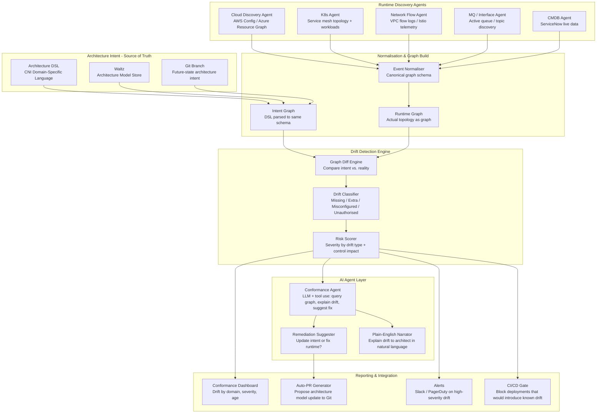

# Idea 1 — Runtime Architecture Conformance & Testing ✅ SELECTED

> **Sponsor**: Srividya Gopalan / Edi Baker Wells | **Mentor**: TBC
> **Key Contact**: Pete Suggitt (CNI Architecture Lead) — he owns the existing Architecture-as-Code toolchain this builds on
> **My Goal**: Learn Agentic AI + Knowledge Graphs + Runtime Observability through a real architecture problem

---

## 📌 Action Pointers — Where to Start When You Return

### Immediate First Steps
- [ ] **Email / contact Pete Suggitt directly** — he is the most critical stakeholder; request access to the CNI Architecture DSL schema and the TMS POC as a reference implementation
- [ ] **Key question to ask Pete first**: *"Can we get a copy of the DSL schema and the TMS deployment architecture model to understand the data structure we're comparing against?"*
- [ ] **Ask Sponsors (Srividya / Edi)** for a kick-off session — clarify scope (cloud-first as Pete advised) and confirm which AI platform is approved

### Understand the Existing Foundation First
- [ ] **What is the CNI DSL format?** — Is it YAML, JSON, a custom format? Get a sample file
- [ ] **What does Waltz store?** — Understand what's already in Waltz vs. what's in the raw DSL
- [ ] **Which live feeds are already ingested?** — ServiceNow (business apps), MQ, Argon — understand their schema

### Top 3 Technical Skills to Build First
1. **Graph databases (Neo4j or NetworkX)** — model architecture as a graph: nodes = services/interfaces/data flows, edges = connections
2. **Cloud discovery APIs** — AWS Config / Azure Resource Graph to enumerate actual runtime resources and their tags
3. **Graph diffing** — comparing two graphs to find what's missing, extra, or misconfigured — the core technical challenge

### Key Technical Decisions to Pin Down Early
- [ ] **Which cloud provider** is TMS on? (AWS / Azure / GCP) — determines discovery APIs
- [ ] **What is the canonical node schema?** — A service node in the DSL must map 1:1 to an asset tag in the cloud
- [ ] **Is drift detection event-driven** (CloudTrail / Azure Monitor events trigger a check) or **periodic** (nightly scan)?

### Your Learning Milestones
- **Week 1–2**: Parse the DSL into a Python graph (NetworkX); visualise the TMS architecture as a node graph
- **Week 3–4**: Write a cloud discovery script that enumerates all TMS assets in AWS Config; model as the same graph schema
- **Week 5–6**: Build the graph diff engine — produce a JSON report of: missing nodes, extra nodes, mismatched connections
- **Week 7–8**: Add LLM agent layer — agent reads the diff and writes a plain-English explanation + remediation suggestion
- **Week 9+**: Auto-PR generator — agent opens a GitHub PR to update the DSL when runtime is ahead of the model

### Sponsor's Key Advice (from Pete's pitch) — Pin This
> *"Start with deployment architecture first — cloud assets, concrete infrastructure. The high-level architecture outcomes are a bit fluffy. Start where the data is clean."*

- ✅ Start with: **cloud asset inventory** (compute, network, MQ topics, data flows)
- ❌ Don't start with: business outcomes, five-star architecture intent (too abstract for MVP)

### Avoid These Pitfalls
- ⚠️ Don't try to parse the full DSL on day one — start with one domain (TMS) and one resource type (EC2/ECS services)
- ⚠️ Asset tagging is foundational — if cloud resources aren't tagged with `service-name` and `architecture-ref`, the diff won't work. Raise this with Pete early.
- ⚠️ Drift is bidirectional — sometimes runtime is *right* and the DSL needs updating. Design the agent to present both options.

---


---

## 📋 From the Brief

| Field | Detail |
|---|---|
| **Title** | Runtime Architecture Conformance & Testing |
| **Sponsor** | Srividya Gopalan / Edi Baker Wells |
| **Mentor** | TBC |
| **Core Problem** | Architecture intent frequently diverges from production reality, creating gaps between designed and deployed systems. Teams lack visibility into whether services, data flows, and controls conform to architectural specifications in running environments. This divergence leads to increased incidents, security vulnerabilities, and technical debt as unauthorised integrations, rogue data flows, and control violations go undetected. |
| **Impact** | Development teams inherit non-conformant systems; operations teams managing unexpected behaviours; architecture teams unable to enforce standards. Without continuous validation, the gap widens over time, making remediation increasingly costly and risky. |
| **Urgency** | Architectural drift directly correlates with production incidents and regulatory compliance failures. |

### Proposed Scope (from brief)
- Continuously validate production systems against architectural specifications
- Represent architecture specifications in machine-readable formats
- Detect deviations between intended and actual system topology
- Validate architectural qualities through testing
- Surface conformance status through various touchpoints

---

## 🎯 Sponsor's Pitch — What They Actually Have & What They Need

> *"Architects are great at defining stuff and saying this is what things should look like. And then when you go and look at it afterwards — it don't look like that."*
> — Pete Suggitt (CNI Architecture), verbatim pitch

### What Already Exists (The Foundation)

This is **not a greenfield project**. CNI already has:

| Asset | Description |
|---|---|
| **Architecture DSL** | A domain-specific language describing everything from business strategy → architecture outcomes → deployment architecture (down to IP addresses in the TMS POC) |
| **Five-Star Framework** | Business strategy, outcomes, architecture assessments, linked to applications and programmes — all described in the DSL |
| **Data ingestion from live systems** | ServiceNow feeds business applications into architecture-as-code. MQ feeds and Argon feeds pulled from infrastructure and pushed back in. |
| **Waltz integration** | Some architecture data is kept in Waltz and synchronised with architecture-as-code |
| **Intent-driven deployment vision** | Branch-based architecture → merge → pipeline → Terraform → cloud; already POC'd for TMS |

### What Is Missing (The Gap to Solve)

> *"There's no tooling or approach that can take that architecture definition — whether that ends up being the Terraform implementation or the result of the pipeline — and compare that to the runtime environment. Telling us what that drift looked like, flagging to us when those things are different, suggesting what those changes might come back and look like."*

**The unsolved problem is a three-step challenge:**
1. **Compare**: Architecture-as-Code definition ↔ Runtime environment (cloud assets, running services, data flows)
2. **Detect**: Flag exactly where drift exists — what is in the runtime but not in the intent, and vice versa
3. **Suggest**: AI-generated remediation — either update the architecture model to reflect reality, or generate the change needed to bring reality back to intent

### Scope Advice from Sponsor
> *"Anyone who takes this project on: pick the deployment architecture first. Look at the base level — the assets being deployed, the types of architecture — and work backwards. The high-level stuff (architecture outcomes) is a little more fluffy. Start concrete."*

**Practical starting point:**
- Cloud environment (better tagging, better API visibility than on-prem)
- Asset tagging to enable cross-correlation
- Infrastructure-level: compute, network, data flows, MQ topics, interfaces

---

## 🎓 Why This Could Be the #1 Learning Choice Overall

| Skill Area | What You Will Learn |
|---|---|
| **Agentic AI** | AI agent that observes runtime, compares to architecture model, reasons about drift, suggests fixes |
| **Architecture Observability** | Instrumenting architecture intent as a continuous compliance check — not a one-off review |
| **Knowledge Graphs** | Modelling architecture intent as a graph (services, interfaces, data flows, actors) for comparison |
| **Runtime Discovery** | Cloud APIs (AWS Config, Azure Resource Graph), Kubernetes APIs, service mesh observability (Istio/Linkerd) to discover actual topology |
| **Graph Diffing** | Comparing two graphs (intended vs. actual) and computing meaningful diffs — a novel technical challenge |
| **DSL / Architecture-as-Code** | Working with the CNI DSL and extending it; understanding architecture modelling at enterprise scale |
| **GitOps** | Branch-based architecture → merge → pipeline → enforcement; real-world GitOps for architecture |
| **Terraform / IaC** | Mapping architecture intent to Terraform plans and comparing with runtime state |

---

## ❓ Questions for Sponsor (Srividya Gopalan / Edi Baker Wells) & Pete Suggitt

### On the Existing Architecture-as-Code Foundation
1. Can we get access to the CNI Architecture DSL schema and the TMS POC as a reference implementation? Understanding the existing data model is the most important first step.
2. What format does the DSL produce — is it a structured graph (JSON/YAML/RDF), or is it a document-oriented format? Does it have a machine-readable API?
3. What does the Waltz integration look like — is Waltz the system of record for the architecture graph, or is the DSL the system of record and Waltz a view?
4. For the data already being pulled from live systems (ServiceNow, MQ, Argon) — what format does that come in, and what's the refresh cadence (real-time, daily, weekly)?

### On Defining "Drift"
5. What is the most common type of drift today? (A service that exists in the runtime but not in the architecture model? A data flow that was never declared? A network connection that bypasses the intended pattern?)
6. Is drift always bad? Or are there cases where the runtime is *correct* and the architecture model needs updating? How does the system know which way to resolve?
7. For cloud assets — is asset tagging already enforced (e.g., every EC2/ECS resource tagged with `service-name`, `data-domain`, `architecture-ref`)? Or is that also to be established?

### On the AI / Agent Approach
8. When the sponsor says "agent-based interfaces" — is the vision a **continuous background agent** that monitors and alerts, or an **on-demand agent** that you interrogate ("show me drift for the TMS domain")?
9. For drift suggestions — should the agent suggest: (a) bring runtime back to architecture intent, (b) update the architecture model to match runtime reality, or (c) present both options for a human to decide?
10. Is there a preference for a specific AI platform? Given the sensitivity of architecture data, cloud vs. on-prem LLM matters.

### On Scope
11. Starting with cloud — which cloud provider is the TMS POC on (AWS / Azure / GCP)? This determines which discovery APIs are available.
12. Is on-prem (MQ, mainframe-adjacent services) in scope for the MVP, or phase 2?
13. Should the conformance check run **continuously** (event-driven from infrastructure change events) or **periodically** (nightly scan)?

---

## 🏗️ High-Level Solution

### The Core Model: Intent vs. Reality as Two Graphs

```
Architecture DSL (Intent Graph)          Runtime Discovery (Reality Graph)
─────────────────────────────           ──────────────────────────────────
  services: [TMS-API, TMS-DB]             EC2: i-abc123 (tagged: TMS-API)
  interfaces: [TMS-API → TMS-DB]          RDS: db-xyz (tagged: TMS-DB)
  data_flows: [CustomerData]              VPC flow logs: TMS-API → TMS-DB ✓
  actors: [PaymentService]               Unexpected: TMS-API → ExtService ✗
                                         Missing: CustomerData flow tag ✗

                      ↓ Graph Diff Engine ↓
                   DRIFT REPORT + AI SUGGESTIONS
```

### Architecture Overview



### Core Components

| Component | Technology Options | Purpose |
|---|---|---|
| Architecture DSL Parser | Custom (build on CNI existing DSL) | Convert DSL to canonical graph model |
| Runtime Cloud Discovery | AWS Config / Azure Resource Graph / GCP Asset Inventory | Discover all runtime assets with tags |
| K8s Discovery | Kubernetes API + Istio/Linkerd service mesh | Service-to-service connections, workload topology |
| Graph Normalisation | Python + NetworkX / Neo4j | Common node/edge schema for both intent and runtime |
| Graph Diff Engine | Custom Python graph comparison | Find missing, extra, and misconfigured elements |
| Drift Classifier | Rule-based + ML classifier | Categorise drift type and severity |
| AI Conformance Agent | LangGraph + LLM (GPT-4 / Gemini) | Natural language explanation + remediation suggestions |
| Auto-PR Generator | GitHub API | Open a PR to update architecture model when runtime is ahead |
| Conformance Dashboard | Grafana / custom web UI | Drift by domain, service, data flow, age |
| CI/CD Gate | GitHub Actions / Jenkins | Fail deployments that introduce declared architecture violations |

### Phased Delivery (12 Weeks) — As the Sponsor Suggested: Start Concrete

| Phase | Weeks | Focus |
|---|---|---|
| Foundation | 1–3 | Parse CNI DSL into canonical graph; build cloud discovery agent for TMS in AWS; normalise to shared schema |
| Drift Detection | 4–6 | Graph diff engine; drift classifier; first conformance report for TMS |
| AI Agent | 7–9 | LLM agent for natural language drift explanation and remediation suggestion; auto-PR for model updates |
| Scale & Integration | 10–12 | K8s + network flow agents; CI/CD gate; conformance dashboard; extend to second domain |

---

## 📊 Success Metrics

| Goal | Metric | Target |
|---|---|---|
| Detect drift | % of runtime assets correlated to architecture intent | >90% for cloud assets in pilot domain |
| Reduce incidents from drift | Incidents attributable to undeclared architectural changes | Baseline, then trending down |
| Speed of detection | Time from a drift-introducing change to detection | <24 hours for cloud; near-real-time with event-driven approach |
| Remediation quality | % of AI-suggested remediations accepted by architects | Track and improve over time |
| Architecture model accuracy | % of DSL definitions verified against runtime | Establish baseline; target >80% verified |

---

## 💡 Key Insight for Your Conversation

The most powerful thing about this idea: **the foundation already exists**. CNI has the architecture DSL, the Waltz integration, and the data ingestion from live systems. This project is not "build architecture-as-code" — that's done. It's **"close the loop"** — add the feedback channel from runtime back to intent, with AI to reason about the gap. That makes this a much more tractable and impactful project than it might appear.
