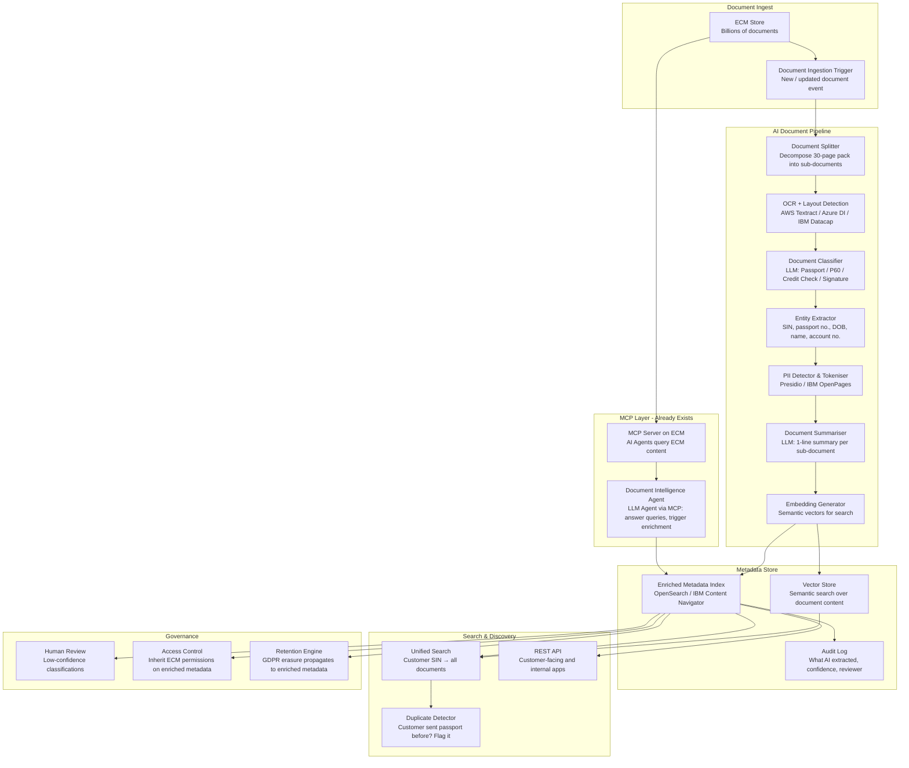

# Idea 10 — Metadata Enhancement for Physical & Digital Documents ✅ SELECTED

> **Sponsor**: Darren Briddle (ECM Team) | **Mentor**: TBC
> **My Goal**: Learn deep document AI — IDP, OCR, LLM extraction, vector search, and MCP-based AI agents at billion-document scale

---

## 📌 Action Pointers — Where to Start When You Return

### Immediate First Steps
- [ ] **Email Sponsor (Darren Briddle)** — introduce yourself, confirm selection, ask for access to ECM sandbox/test environment
- [ ] **Most important first question**: *"Can you share the MCP server documentation for ECM — what endpoints are exposed, what queries are supported, and which LLM is it connected to?"*
- [ ] **Second question**: *"Which IDP tools and IBM tools does the bank have licensed? Can we get access to them for the pilot?"*

### Understand the MCP Server First — This Is Your Biggest Advantage
- [ ] **MCP (Model Context Protocol)** is cutting-edge — AI agents can directly query ECM via MCP
- [ ] Read: [Model Context Protocol specification](https://modelcontextprotocol.io/) — understand what's possible
- [ ] Experiment: Connect a local LLM (Claude / GPT-4) to the ECM MCP server and ask it document questions
- [ ] **This is your differentiator** — most teams don't have MCP servers on their data stores yet

### Top 3 Technical Skills to Build First
1. **Intelligent Document Processing (IDP)** — AWS Textract or Azure Document Intelligence. Try extracting text + structure from a sample loan pack PDF
2. **Document Classification with LLMs** — few-shot prompting to classify sub-documents: "Is this page a passport, a P60, or a credit check?"
3. **Named Entity Recognition (NER) for banking docs** — extract SIN/NIN numbers, passport numbers, account numbers, dates

### Key Technical Decisions to Pin Down Early
- [ ] **Pilot document type**: Start with loan packs (Darren's example) — one document type, well-understood content
- [ ] **Document classification taxonomy**: Define the list of sub-document types before building the classifier
- [ ] **Batch vs. real-time**: Does the solution enrich at ingest (new documents) or backfill existing documents? Start with new documents.
- [ ] **PII handling**: Confirm the access control model before indexing passport numbers and SIN numbers

### Your Learning Milestones
- **Week 1–2**: Get a sample set of loan pack PDFs from ECM sandbox; run through AWS Textract / Azure DI; see what raw output looks like
- **Week 3**: Write a document splitter — break a 30-page loan pack into individual page clusters
- **Week 4–5**: Build a classifier — LLM prompt to classify each page cluster: Passport / P60 / Bank Statement / Signature
- **Week 6–7**: Add NER — extract passport number, SIN, DOB from classified pages
- **Week 8**: Wire to ECM metadata store — write enriched metadata back via MCP server
- **Week 9+**: Build the search layer — "show all documents for customer SIN X0123456"

### The Use Case to Demo (Darren's exact example)
> A customer submits a loan application. Inside is a 30-page PDF. The AI:
> 1. Splits the pack into: passport (pp.3-4), P60 (pp.7-9), credit check (pp.12-15), signature page (p.28)
> 2. Extracts: Passport No: GBR123456, SIN: X0123456, Expiry: 2027-03-01
> 3. Writes enriched metadata back to ECM
> 4. Next time the customer applies: system checks → "Passport already on file, valid until 2027. No re-submission needed."

**This is your MVP demo. Build towards this.**

### Avoid These Pitfalls
- ⚠️ Don't start with the backfill of billions of documents — start with the ingest pipeline for new documents only
- ⚠️ PII is extremely sensitive here — get sign-off on the data handling approach before indexing passport numbers
- ⚠️ OCR quality on older scans may be poor — set a confidence threshold; route low-confidence extractions to human review
- ⚠️ The document taxonomy (what types exist) needs domain expert input — don't assume, ask Darren's team

---

---

## 📋 From the Brief

| Field | Detail |
|---|---|
| **Title** | Metadata Enhancement for Physical & Digital Documents |
| **Sponsor** | Darren Briddle |
| **Mentor** | TBC |
| **System** | ECM (Enterprise Content Management) — the bank's central document store |
| **Core Problem** | The bank maintains large repositories of documents with inconsistent, incomplete metadata creating friction in content discovery. Internal teams waste time searching. Customers are repeatedly asked to provide documentation the bank already holds. |
| **Urgency** | Billions of documents in ECM; customer experience expectations; Digital X Manifesto mandate to reduce manual workload. |

---

## 🎯 Sponsor's Pitch — What ECM Actually Needs (Darren Briddle, verbatim)

> *"People are starting to pay more attention to these documents. They're not just a graveyard for documents to go and become records managed and disappear."*

### The Real Problem — Inside the Document

> *"Consider a 30-40 page loan pack in a PDF stored within our system. It will have metadata around: sort code, account number, document type — 'it's a loan pack'. But actually inside that loan pack there's a passport, a driver's licence, credit checks, a signature page. There's more to it than just a 30-page PDF."*

**The current metadata only describes the container, not the contents.** AI needs to go inside.

### The Concrete Use Case

> *"We have customers that send in a passport three, four, five, six times for various different products within the bank. And we've actually had customer feedback: 'Why do I have to keep sending you a passport each time?'"*

The goal:
- Break loan packs apart into constituent documents
- Identify that a passport exists inside the pack
- Index it with a SIN number / customer identifier
- Enable search: *"show me all documentation for this customer"* — rather than opening a 30-page PDF and scrolling

### What's Already There (Existing Assets)
> *"Tools that are already in the bank — IDP have some tools, IBM has some tools that can really delve into that data and enrich the metadata. We have MCP servers running on ECM now as well, so we can really get hold of that content."*

| Asset | Description |
|---|---|
| **ECM System** | Active document store with billions of documents |
| **IDP tooling** | Intelligent Document Processing tools already in the bank |
| **IBM tooling** | IBM AI tooling available for document intelligence |
| **MCP Servers** | **Model Context Protocol servers already running on ECM** — this is cutting-edge; AI agents can directly query ECM content |
| **Existing metadata** | Basic: sort code, account number, document type, records management fields |

### The Scope Direction
> *"Enrich that content so we can break those loan packs up, show where the passport is, and be able to search on that passport."*

Not a single customer view — a richer document view for the documents ECM holds for a customer.

---

## 🎓 Why This is #3 for Deep AI Learning

| Skill Area | What You Will Learn |
|---|---|
| **Intelligent Document Processing (IDP)** | IBM Datacap / AWS Textract / Azure Document Intelligence — real enterprise-grade document AI |
| **MCP (Model Context Protocol)** | Bleeding-edge: AI agents querying ECM via MCP servers — the new standard for AI tool use |
| **Document Decomposition** | Splitting multi-document PDFs into constituent parts using AI (layout detection, page classification) |
| **OCR + Layout Detection** | Recognising document structure: passport photo area, signature block, table of contents |
| **NER for Banking Documents** | Extracting SIN/NIN numbers, passport numbers, dates of birth, addresses from unstructured text |
| **RAG on Document Content** | Vector search over billions of documents — scale challenge unlike any other idea |
| **AI Agent for Document Workflows** | Agents that process incoming document packs automatically, enrich metadata, flag exceptions |
| **Privacy-Preserving AI** | Working with PII at massive scale — PII detection, redaction, access control for AI-enriched data |

---

## ❓ Questions for Sponsor (Darren Briddle) & Mentor (TBC)

### On the MCP Server (Most Important)
1. MCP servers are running on ECM — which LLM or AI framework are they connecting to? Is this connected to an internal LLM service or a cloud provider (Azure OpenAI, IBM WatsonX)?
2. What is the current MCP capability — can agents read documents? Can they search? Can they write/update metadata? Understanding the MCP surface area defines what's possible.
3. Are the MCP servers production-grade or experimental? This affects the architecture approach significantly.

### On Document Intelligence
4. The loan pack example — is the current problem that ECM doesn't know what's inside a PDF, or that it knows but has no structured way to surface sub-documents?
5. What formats are documents stored in? (PDF, TIFF scans, native Office docs?) What's the quality of scans (DPI, hand-filled forms, photocopies)?
6. The IDP and IBM tools mentioned — are these licensed and available to use, or would procurement be needed? Have they been evaluated against the specific ECM document types?
7. Is there a classification taxonomy for document types already (e.g., "Passport", "P60", "Bank Statement", "Credit Check") or does that need to be designed?

### On Scale
8. "Billions of documents" — what is the growth rate per day/week? Does the solution need to process documents at ingest (real-time) or can it backfill existing docs in batch?
9. What is the acceptable latency for metadata enrichment? (Real-time at ingest, within 1 hour, overnight?)

### On Privacy & Compliance
10. Passports and SIN numbers are extremely sensitive PII — what is the data classification and access control framework for enriched metadata? Who can query a customer's passport metadata?
11. Does GDPR right-to-erasure apply to enriched metadata? If a document is deleted, must the AI-extracted metadata also be purged?

---

## 🏗️ High-Level Solution

### Architecture Overview

### Core AI Components

| Component | Technology Options | Purpose |
|---|---|---|
| Document Splitter | AWS Textract / Azure DI / PyMuPDF | Identify page boundaries between sub-documents in a multi-doc PDF |
| OCR + Layout | IBM Datacap / AWS Textract / Azure Document Intelligence | Extract text from scans preserving structure |
| Document Classifier | GPT-4 / fine-tuned BERT / IBM WatsonX | Classify each sub-document: Passport, P60, Bank Statement, etc. |
| Entity Extractor | AWS Comprehend / spaCy / Azure Language | Extract SIN, passport number, DOB, name, account numbers |
| PII Tokeniser | Microsoft Presidio / IBM OpenPages | Detect and selectively redact PII before indexing |
| Embedding | text-embedding-3 / Cohere | Semantic vectors for similarity search |
| MCP Integration | Existing MCP server on ECM | AI agents use MCP to query and update ECM content directly |
| Document Agent | LangGraph + LLM via MCP | Natural language queries: "show me all documents for customer X" |
| Vector Search | OpenSearch with FAISS / Pinecone | Semantic search over document content at scale |
| Duplicate Detector | Similarity matching on extracted entities | "This customer already has a valid passport in ECM from 2023" |

### 12-Week Delivery Plan

| Phase | Weeks | Focus |
|---|---|---|
| Discovery & Taxonomy | 1–3 | Audit existing IDP/IBM tools; define document classification taxonomy; select pilot document type (loan packs); design enriched metadata schema |
| Pipeline Build | 4–7 | Build splitter + classifier + NER pipeline; integrate with MCP server; populate metadata index for pilot corpus |
| Search & Dedup | 8–10 | Unified search UI; duplicate passport detector; customer document view API |
| Scale & Govern | 11–12 | GDPR erasure propagation; access controls; confidence thresholds + human review workflow; batch backfill strategy for existing documents |

---

## 📊 Success Metrics

| Goal | Metric | Target |
|---|---|---|
| Reduce passport re-submissions | % reduction in customers asked to re-submit a document already in ECM | >50% in pilot customer segment |
| Document discoverability | Time to find a specific sub-document within a customer's file | From minutes of scrolling → <5 second search |
| Enrichment accuracy | Document classifier precision/recall vs. human review | >92% for top 5 document types |
| Duplicate detection | % of duplicate document requests caught before reaching customer | Baseline then >70% |
| Manual effort reduction | Staff hours saved in document retrieval tasks | Measurable via workflow time-tracking |
