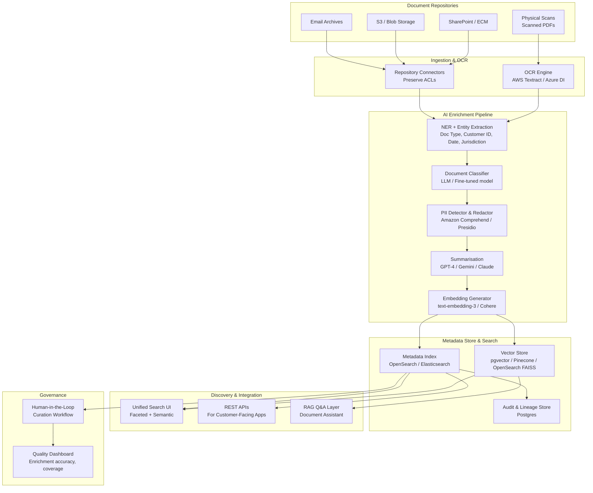

# Idea 10 — Metadata Enhancement for Physical & Digital Documents

> **Ranking: #2 for Learning (AI + Observability)**
> This idea offers the **richest hands-on AI exposure** — you will work with OCR, NLP, Large Language Models, vector search, and automated enrichment pipelines. Ideal if you want to understand applied AI in a real enterprise context.

---

## 📋 From the Brief

| Field | Detail |
|---|---|
| **Title** | Metadata Enhancement for Physical & Digital Documents |
| **Sponsor** | Darren Briddle |
| **Mentor** | TBC |
| **Core Problem** | The bank maintains large repositories of physical and digital documents with **inconsistent, incomplete, or missing metadata**, creating significant friction in content discovery. Internal teams waste time searching for documents they already possess. Customers are repeatedly asked to provide documentation the bank already holds. The lack of structured metadata prevents effective search, retrieval, and reuse of existing content. |
| **Impact** | Operations teams cannot find relevant documents quickly; customer-facing teams repeatedly request the same information; customers experience poor service due to information silos; compliance risks from missing documentation; increased operational costs. |
| **Urgency** | Customer experience expectations, existing research indicating benefit opportunities, the need to avoid redundant information requests, and previously identified funding gaps now being addressed. |

### Proposed Scope (from brief)
- Assess current metadata gaps in internal document stores
- Design target-state metadata models tailored to customer and colleague needs
- Evaluate **automation or AI enrichment** options for existing content
- Stand-alone elements: metadata schema definition, automated enrichment tooling, search and discovery interfaces, integration with customer-facing processes

### Benefits
- Operations teams find documents faster with improved search
- Customer-facing teams access complete information without redundant requests
- Customers avoid providing the same information multiple times
- Enhanced document discoverability across the organisation
- Faster access to information for engineers and business partners
- Better compliance and audit readiness with organised documentation
- Reduced operational costs from improved efficiency

---

## 🎓 Why This is the #2 Learning Choice

| Skill Area | What You Will Learn |
|---|---|
| **Applied AI / NLP** | Named Entity Recognition (NER), document classification, summarisation using LLMs (GPT-4, Gemini, Claude) |
| **OCR & Document Intelligence** | AWS Textract, Azure Document Intelligence, Google Document AI — converting physical docs to structured data |
| **Vector Search & Embeddings** | OpenSearch / Elasticsearch with vector embeddings for semantic search (not just keyword search) |
| **LLM Prompt Engineering** | Designing prompts for metadata extraction, classification, and summarisation of banking documents |
| **RAG (Retrieval-Augmented Generation)** | Building a document Q&A layer on top of the enriched metadata store |
| **Data Governance & Privacy** | PII detection and redaction before AI processing; access control on enriched metadata |
| **MLOps for Enrichment** | Pipeline orchestration (Airflow / Step Functions), confidence scoring, human-in-the-loop review |

---

## ❓ Questions for Sponsor (Darren Briddle) & Mentor (TBC)

### Problem Clarification
1. What types of documents are in scope? (KYC documents, policy documents, contracts, correspondence, scanned physical forms?)
2. What is the approximate volume and growth rate? (millions of documents? Terabytes?)
3. What repositories currently hold these documents? (SharePoint, FileNet, ECM, S3/Blob, email archives, physical scanning systems?)
4. Is the primary pain point **internal search** (employees), **customer-facing reuse** ("we already have this document"), or **compliance/audit discovery**?
5. What metadata exists today? Is there any schema or taxonomy currently applied, even inconsistently?

### Scope & Prioritisation
6. What are the 2–3 highest-value document types to start with for the pilot?
7. Is there an existing AI budget or approved cloud AI services available? (AWS Bedrock, Azure OpenAI, GCP Vertex AI?)
8. Are there data sovereignty or residency restrictions on which documents can pass through cloud AI services?
9. Is OCR already applied to physical document scans, or does that need to be built?
10. What search experience currently exists for staff? (SharePoint Search, manual folder browsing, nothing structured?)

### Technical & Compliance
11. What PII/sensitive data classification exists on documents today? (e.g., KYC docs contain customer PII — how do we handle this with AI?)
12. Is there an existing IAM/DRM system that controls document access? The enriched metadata must inherit these access controls.
13. What is the appetite for a **human-in-the-loop** review step for AI-generated metadata before it is published?
14. Are there regulatory requirements for how long enriched metadata must be retained or audited?

---

## 🏗️ High-Level Solution

### Architecture Overview

### Core AI Components
| Component | Technology Options | Purpose |
|---|---|---|
| OCR | AWS Textract / Azure Document Intelligence | Extract text from scans, PDFs, images |
| NER / Entity Extraction | AWS Comprehend / spaCy / Azure Language | Extract doc type, IDs, dates, jurisdiction |
| Document Classifier | Fine-tuned BERT / GPT-4 with few-shot prompts | Categorise documents into standard taxonomy |
| PII Detection | Amazon Comprehend / Microsoft Presidio | Detect and redact sensitive fields before indexing |
| Summarisation | GPT-4 / Gemini Pro / Claude Haiku | Generate concise summaries for search snippets |
| Semantic Search | OpenSearch with FAISS / Pinecone | Vector-based similarity search beyond keywords |
| RAG Q&A | LangChain + LLM | Answer staff queries citing source documents |
| Confidence Scoring | Custom threshold layer | Route low-confidence predictions to human review |

### 12-Week Delivery Plan
| Phase | Weeks | Focus |
|---|---|---|
| Assess & Design | 1–3 | Inventory repos, define metadata schema, select AI stack, choose pilot (e.g., KYC docs) |
| Build Enrichment Pipeline | 4–7 | OCR + NER + Classifier + PII; stand up metadata store and search index |
| Pilot & Tune | 8–11 | Run pilot corpus, measure accuracy, add human review loop, tune relevance |
| Harden & Expand | 12–16 | Add repos, enforce access controls, add RAG Q&A layer, dashboards |

---

## 📊 Success Metrics
- Document search success rate (searches returning relevant results in top 3) → target >85%
- Reduction in duplicate document requests from customers → target >50% in pilot domains
- Enrichment accuracy (metadata precision/recall vs human review) → target >90% for key fields
- Time to find a document (baseline vs. after) → target 80% reduction
