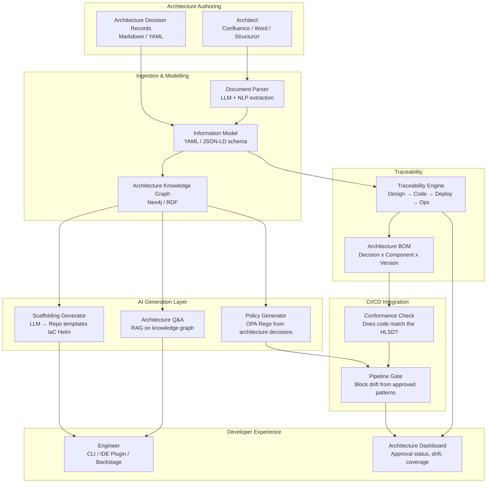

# Idea 2 — Beyond Documents: Reimagining Architecture and Engineering

> **Learning Ranking: ~#2.5 — Strong AI angle, lighter on Observability**
> This idea is centred on **AI-assisted architecture automation** — transforming static HLSD/5-Star documents into machine-readable, executable assets. It teaches LLM-based code/template generation, information modelling, traceability tooling, and pipeline integration. If your interest is in *AI for developer tooling and architecture automation*, this ranks alongside Idea 10.

---

## 📋 From the Brief

| Field | Detail |
|---|---|
| **Title** | Beyond Documents: Reimagining Architecture and Engineering |
| **Sponsor** | Nanda Ronaki / Simon Stone |
| **Mentor** | Mario Xavier |
| **Core Problem** | High-Level Solution Design (HLSD) and 5-Star architecture artefacts are **predominantly document-centric**, creating friction throughout the delivery lifecycle. Teams experience hand-offs between architecture and engineering, reinterpretation of design intent, and governance bottlenecks. The document-based approach leads to rework when designs are misunderstood, delays in architecture approval processes, and difficulty maintaining traceability from design through build to operations. |
| **Impact** | Delivery teams waiting for approvals; architects spending time on repetitive governance activities; programme managers facing unpredictable lead times. |
| **Consequences** | Slower time-to-market, increased rework costs, inconsistent application of architectural patterns. |
| **Urgency** | Volume of initiatives requiring architecture review and competitive pressure to accelerate delivery. |

### Proposed Scope (from brief)
- Transform architecture artefacts from **documents into machine-readable, integrated assets** within development workflows
- Creating machine-readable representations of HLSD content
- Generating **scaffolding and templates from architectural decisions**
- Establishing traceability mechanisms across the lifecycle
- Integrating with repositories and pipelines
- Stand-alone elements: information model definition, pattern and policy generators, decision logging frameworks, and traceability tooling

### Benefits
- Architects spend less time on repetitive documentation and governance
- Development teams receive consistent, actionable guidance from architecture
- Programme managers gain predictable architecture approval timelines
- Reduced rework from design misinterpretation
- Increased reuse of approved architectural patterns
- Faster lead-time from architecture approval to delivery
- Customers benefit from faster feature delivery with maintained quality

---

## 🎓 Learning Value Breakdown

| Skill Area | What You Will Learn |
|---|---|
| **AI for Code Generation** | LLMs generating scaffolding, CI/CD templates, IaC from architectural decisions — prompt engineering + RAG |
| **Information Modelling** | Designing machine-readable schemas for architecture artefacts (JSON-LD, YAML, OpenAPI, ArchiMate-inspired) |
| **Traceability Engineering** | Linking architecture decisions → code → test → deployed artefact (SBOM-style lineage for architecture) |
| **Architecture-as-Code** | Converting HLSDs to executable policy/conformance checks using OPA/Rego or custom DSLs |
| **LLM + Knowledge Graphs** | Using LLMs on top of a knowledge graph of architecture decisions for Q&A and pattern recommendation |
| **Developer Tooling** | Building IDE plugins or CLI tools that generate project scaffolding from architecture models |
| **Pipeline Integration** | Embedding architecture conformance checks into CI/CD (same muscle as Idea 3, different domain) |

---

## ❓ Questions for Sponsors (Nanda Ronaki / Simon Stone) & Mentor (Mario Xavier)

### Problem Clarification
1. What does a typical HLSD or 5-Star architecture artefact look like today — Word/Confluence page, Visio diagram, or a structured template? What sections are mandatory?
2. How many architecture reviews are processed per quarter? What is the average lead time from submission to approval today?
3. What is the primary source of rework — misunderstood design intent, missing decisions, or outdated documents diverging from what was built?
4. Is there a catalogue of approved architectural patterns today? If yes, in what format and where is it stored?
5. Who are the consumers of HLSD artefacts — engineering leads, DevOps teams, security reviewers? Each has different needs from a "machine-readable" format.

### Scope & Prioritisation
6. What does "machine-readable architecture artefact" mean in your ideal state — a YAML/JSON schema? An ArchiMate model? An OpenAPI-like spec? Or an LLM prompt-able knowledge base?
7. Which domains or programmes would be the best pilot candidates (e.g., a current active programme with a well-defined HLSD)?
8. Should scaffolding generation be opinionated (generates a specific stack) or flexible (generates templates parameterised by stack choice)?
9. Is traceability from design → code → deployment a new requirement, or do some teams already do this partially with ADRs (Architecture Decision Records)?
10. Are there existing tools in use — Structurizr, Backstage, Confluence, Jira — that we should integrate with rather than replace?

### AI & Technical Constraints
11. Is there access to an approved LLM service? (Azure OpenAI, AWS Bedrock, or local/on-prem model?) This affects the design significantly for a regulated bank.
12. What is the sensitivity classification of HLSD documents — can they be passed to cloud-hosted LLMs, or must processing remain on-prem?
13. Are repositories standardised? (GitHub Enterprise, Azure DevOps, Bitbucket?) The scaffolding generator needs to target a specific VCS.
14. Is there appetite for an **architecture conformance check in CI/CD** — i.e., the pipeline validates that the code matches what the architecture document specified?

---

## 🏗️ High-Level Solution

### Architecture Overview

### Core Components

| Component | Technology Options | Purpose |
|---|---|---|
| Document Parser | GPT-4 / Gemini + LangChain | Extract structured decisions, components, patterns from HLSD prose |
| Information Model | YAML schema / JSON-LD / ArchiMate | Machine-readable representation of architecture artefacts |
| Knowledge Graph | Neo4j / Apache Jena / RDF | Store relationships: decisions → components → patterns → teams |
| Scaffolding Generator | LLM + Cookiecutter/Yeoman templates | Generate project scaffolding, IaC, CI/CD templates from architecture models |
| Policy Generator | OPA/Rego from architecture constraints | Auto-generate conformance policies from HLSD constraints |
| RAG Q&A | LangChain + LLM + Knowledge Graph | Answer "what did we decide about X?" from architecture knowledge base |
| Traceability Engine | Custom + SBOM tooling (CycloneDX) | Link architecture decisions to code commits, deployments, and running services |
| Conformance Check CI | OPA + custom diff logic | Detect when code drifts from what the architecture specified |
| Developer Portal | Backstage / internal CLI | Surface scaffolding, decisions, conformance status to engineers |

### 12-Week Delivery Plan

| Phase | Weeks | Focus |
|---|---|---|
| Discovery & Modelling | 1–3 | Select pilot HLSD, define information model schema, map current HLSD sections to machine-readable fields, choose AI stack |
| Parse & Enrich | 4–6 | Build LLM-based HLSD parser; populate knowledge graph with pilot domain; stand up Q&A RAG prototype |
| Generate & Scaffold | 7–9 | Build scaffolding generator (project templates from architecture model); policy generator (OPA from constraints) |
| Trace & Integrate | 10–12 | Traceability links (decisions → repo → deployment); conformance check in CI/CD pipeline; architecture dashboard |

---

## 📊 How This Compares to the Top 3

| Dimension | Idea 7 (Data Flow) | Idea 10 (Metadata) | Idea 3 (Controls) | **Idea 2 (Beyond Docs)** |
|---|---|---|---|---|
| AI Exposure | Medium | **High** | Medium | **High** |
| Observability | **High** | Low | High | Medium |
| DevOps/Platform | Medium | Low | **High** | High |
| Architecture Skills | Low | Low | Medium | **High** |
| Novelty / Innovation | High | High | Medium | **Very High** |
| Sponsor Access | Dawn Trinder | Darren Briddle | Pete Suggitt | **Nanda Ronaki / Simon Stone** |

> **Bottom line:** If you're interested in the intersection of **AI + Architecture automation**, Idea 2 ranks #2 overall and may even be more interesting than Idea 10. The key constraint is LLM data residency — confirm that HLSD documents can be processed by cloud AI services.

---

## 📊 Success Metrics
- Time from HLSD submission to architecture approval → target 50% reduction in pilot programmes
- % of new projects using auto-generated scaffolding from architecture model → target >70%
- Architecture drift incidents (code deviating from approved HLSD) → target >60% detected automatically in CI/CD
- Architect hours spent on repetitive governance activities (baseline vs. after) → target 40% reduction
