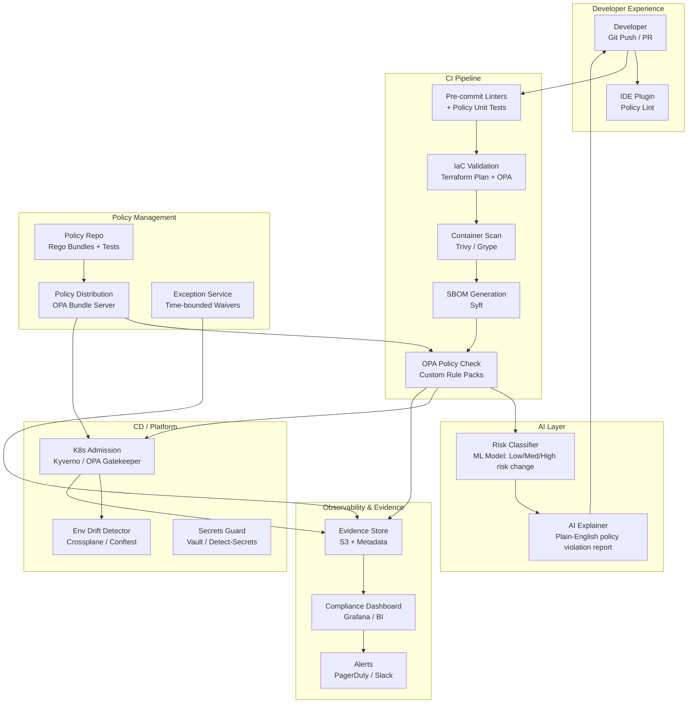

# Idea 3 — Controls-as-Code: Preventative, Automated Controls

> **Ranking: #3 for Learning (AI + Observability)**
> This idea teaches **platform observability and AI-enhanced policy enforcement** — you will learn how to write policy-as-code (OPA/Rego), instrument CI/CD pipelines, and use AI to detect control violations before they reach production. Strong DevSecOps skills with direct applicability to cloud architecture roles.

---

## 📋 From the Brief

| Field | Detail |
|---|---|
| **Title** | Controls-as-Code: Preventative, Automated Controls |
| **Sponsor** | Pete Suggitt / Denis |
| **Mentor** | Joel King |
| **Core Problem** | Current control mechanisms are predominantly **detective and manual** — identifying issues only after they occur rather than preventing them. Teams lack automated, preventative controls that can enforce security, privacy, and service readiness requirements at the **point of change**. This reactive approach leads to late discovery of control violations, increased remediation costs, and extended time-to-production as issues are found and fixed iteratively. |
| **Impact** | Development teams facing late-stage rework; security teams managing avoidable incidents; compliance teams dealing with preventable violations. |
| **Consequences** | Higher defect rates, longer cycle times, increased risk exposure. |
| **Urgency** | Growing volume of changes and the need to shift control enforcement **left** in the delivery lifecycle to reduce risk and accelerate flow. |

### Proposed Scope (from brief)
- Framework for defining and enforcing controls as **executable policies** within delivery pipelines and platforms
- Policy definition languages, building rule packs for key controls
- Integrating enforcement into CI/CD pipelines
- Generating automated attestation evidence
- Stand-alone elements: policy framework definition, pipeline integration plugins, exception workflow management, compliance dashboards

### Benefits
- Development teams receive immediate feedback on control violations
- Security teams prevent issues rather than detecting them post-deployment
- Compliance teams gain automated evidence of control enforcement
- Shift from detective to preventative controls
- Reduced gate pass-through time with automated checks
- Faster exception resolution cycles
- Decreased audit findings through proactive compliance
- Customers benefit from more secure, compliant services delivered faster

---

## 🎓 Why This is the #3 Learning Choice

| Skill Area | What You Will Learn |
|---|---|
| **Policy-as-Code** | OPA (Open Policy Agent) and Rego language — writing machine-enforceable governance policies |
| **Platform Observability** | Instrumenting CI/CD pipelines with metrics: gate latency, pass/fail rates, control coverage % |
| **DevSecOps** | Shifting security left — embedding controls into GitHub Actions, Terraform, Kubernetes admission |
| **AI for Anomaly Detection** | Using ML to detect unusual patterns in deployment configs, flag policy drift, classify risk |
| **Compliance Automation** | Auto-generating audit evidence (SBOM, attestation artefacts) per build/release |
| **Kubernetes & Cloud Security** | Kyverno / OPA Gatekeeper for admission control; Trivy for container scanning; Vault for secrets |
| **Exception Management** | Building lightweight governance workflows with audit trails and auto-expiry |

---

## ❓ Questions for Sponsor (Pete Suggitt / Denis) & Mentor (Joel King)

### Problem Clarification
1. Which control frameworks are in scope? (CIS Benchmarks, NIST, SOC2, ISO 27001, PCI DSS, FCA requirements?)
2. What are the **top 5 highest-impact controls** that cause the most rework or audit findings today — can you rank them?
3. Is the current detection process manual (code reviews, manual audits) or partially automated (SAST tools, SonarQube)?
4. What is the approximate ratio of detective vs. preventative controls today? This sets the baseline.
5. Are there controls that teams are **exempting themselves from** because the process is too slow? How are waivers managed today?

### Scope & Prioritisation
6. Which CI/CD platforms are in scope? (GitHub Actions, Jenkins, GitLab, Azure DevOps?) Is there a standard or a mix?
7. Are infrastructure definitions written as IaC (Terraform/CloudFormation)? Are Kubernetes manifests managed with Helm/Kustomize?
8. Which environments need hard gates (dev/test/pre-prod/prod)? Can we start advisory in prod and blocking in non-prod?
9. Is there an existing OPA/Sentinel/Kyverno deployment, or would this be greenfield policy tooling?
10. What is the acceptable pipeline gate latency SLO? (e.g., <30 seconds for a CI check?)

### AI & Observability Angle
11. Is there interest in using **AI to classify code changes by risk level** — so high-risk changes trigger additional controls automatically?
12. Should the observability layer surface control metrics to a compliance dashboard (e.g., number of violations, MTTR, exception volume)?
13. Are AI-generated summaries of policy violations (explaining what failed and why, in plain English) acceptable for developer-facing feedback?
14. Is there a preference for evidence artefacts stored in S3/Blob, or must they integrate with an existing GRC platform (e.g., ServiceNow)?

---

## 🏗️ High-Level Solution

### Architecture Overview

### Core Components
| Component | Technology Options | Purpose |
|---|---|---|
| Policy Authoring | OPA / Rego + Git | Version-controlled, unit-tested policy packs per control domain |
| Policy Distribution | OPA Bundle Server / Styra DAS | Signed bundles served to CI and admission controllers |
| CI Enforcement | GitHub Actions / Jenkins Plugin | IaC validation, container scan, SBOM, OPA checks per PR |
| K8s Admission | Kyverno / OPA Gatekeeper | Block non-compliant workloads at deploy time |
| AI Risk Classifier | Python ML model (scikit-learn / LLM) | Classify change risk level; trigger additional checks for high-risk |
| AI Explainer | GPT-4 / local LLM | Convert policy violation JSON into plain-English developer feedback |
| Exception Workflow | Jira / ServiceNow integration | Time-bounded waivers with auto-expiry, owner tracking, audit trail |
| Evidence Store | S3 + DynamoDB metadata | Immutable evidence per build/release for audit readiness |
| Observability | Grafana + Prometheus | Gate latency SLOs, pass/fail rates, control coverage %, bypass alerts |

### 12-Week Delivery Plan
| Phase | Weeks | Focus |
|---|---|---|
| Align & Select | 1–2 | Map top 10 priority controls; choose OPA + pipeline plugins; define evidence schema and gate latency SLO |
| Bootstrap | 3–4 | Policy repo created, CI for Rego tests; ship first bundles (Terraform tagging, network egress, secrets, image signing) |
| CI/CD Integration | 5–7 | Pipeline steps on 2 anchor services; admission controller in non-prod; evidence collection + dashboards live |
| Scale & Exceptions | 8–10 | Waiver workflow, expand control pack (PII tagging, TLS, SBOM), AI risk classifier piloted |
| Harden & Certify | 11–12 | Performance tuning, SLO alerts, red/blue testing, operating model documented, audit attestation prep |

---

## 📊 Success Metrics
- % of critical controls covered by automated enforcement → target >90% within pilot scope
- Control violation detection time: from "after deployment" to "before merge" (shift-left success)
- Evidence auto-generation coverage → target 100% of tracked builds have attestation artefacts
- Developer feedback loop time on violations → target <2 minutes from push to explanation
- Audit finding reduction in controlled domains → target >40% within 6 months
