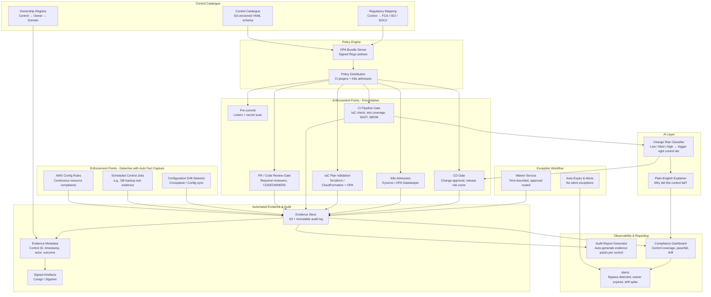

# Idea 3 — Controls-as-Code: Preventative, Automated Controls

> **Sponsor**: Pete Suggitt / Denis | **Mentor**: Joel King
> **Learning Ranking: #3 — DevSecOps + Policy Automation with AI enforcement**

---

## 📋 From the Brief

| Field | Detail |
|---|---|
| **Core Problem** | Current control mechanisms are predominantly **detective and manual** — identifying issues only *after* they occur. Teams lack automated, preventative controls that enforce security, privacy, and service readiness at the **point of change**. |
| **Consequences** | Higher defect rates, longer cycle times, increased regulatory and audit risk. |
| **Urgency** | Growing volume of changes; need to shift control enforcement **left** in the lifecycle. |

---

## 🎯 Sponsor's Vision — What They Actually Want

> *"What we want to have is fully automated fact capture with preventative controls. The model where you **can't do things wrong because something will stop you**."*
> — Sponsor Context

This is not a tooling project. It's a **fundamental rethink of the control model**. Here's the framing in the sponsor's own words:

### The Current State (Problem Framing)
- The firm equates **spreadsheets + manual process = good control**. That assumption is wrong.
- There are **"clipboard police"** — people running around verifying that other people did what they said they'd do.
- Respondents **attest they've complied**, often without fully checking. Attestation without verification.
- Result: **audit findings and regulatory risk** — "that thing you said you'd do, you didn't do it, or not to the right quality."
- The obvious costs: audit remediation effort, regulatory penalties, and the operational overhead of running a compliance-through-humans model indefinitely.

### The Target State (Vision)
- A **genuinely digital control offering**: controls are machine-readable, machine-executable, and machine-verified.
- **Preventative, not detective**: the system stops the wrong action *before* it can complete — not flags it after.
- **Automated fact capture**: evidence is generated automatically at the point of the controlled action — no human attestation required.
- The control catalogue is a **living codebase**, not a Word document or spreadsheet.

### Sponsor's Specific Questions to Answer
The sponsor explicitly asked these as open design questions:

1. **What does "policy-as-code" actually mean** in this context — for SDLC adherence, cloud-based controls, regulatory controls (e.g., database backup testing)?
2. **What should the design look like?** What is the overall architecture?
3. **How do we manage the controls?** Ownership, lifecycle, versioning, deprecation?
4. **What does the control catalogue look like?** How are controls described in a machine-readable format?
5. **How do you *affect* those controls?** What enforcement mechanisms exist at each point in the delivery lifecycle?
6. **On what data does it enact?** What are the data sources: IaC plans, runtime metrics, deployment artefacts, pipeline logs?

---

## 🎓 Learning Value

| Skill Area | What You Will Learn |
|---|---|
| **Policy-as-Code** | OPA/Rego — writing machine-enforceable control definitions |
| **Control Catalogue Design** | How to define controls in a structured, machine-readable schema |
| **DevSecOps / Shift Left** | Embedding control enforcement into CI/CD, not post-deployment audits |
| **Platform Observability** | Instrumenting pipelines with control pass/fail metrics, audit evidence |
| **AI for Risk Classification** | ML to classify change risk and trigger the right control tier |
| **Regulatory Mapping** | Mapping firm control requirements to executable policy (SDLC, cloud, data) |
| **Kubernetes & Cloud Security** | Admission controllers (Kyverno/OPA Gatekeeper) for runtime enforcement |

---

## ❓ Questions for Sponsor (Pete Suggitt / Denis) & Mentor (Joel King)

### Directly Addressing the Sponsor's Open Questions

**On "What does policy-as-code mean here?"**
1. Are we starting with the **SDLC controls** the sponsor mentioned (the most familiar to the audience) — and if so, which specific SDLC gates are most violated today (code review, test coverage, security scan, change approval)?
2. What is an example of a **cloud-based control** that is currently managed with a spreadsheet? (e.g., "all production databases must have backups enabled and tested monthly") — walking through one real example will define the pattern.
3. For **regulatory controls** like database backup testing — is the control about *whether* the task was done, or *whether it was done to a specified quality*? The answer changes the enforcement mechanism.

**On "What does the control catalogue look like?"**
4. Is there an existing control catalogue (even in a document/spreadsheet) that can be used as the starting inventory, or does the catalogue need to be built from scratch?
5. How many distinct controls are in scope — rough order of magnitude? (tens, hundreds, thousands?)
6. Who *owns* a control today — the risk team, the security team, the control owner in a business unit? That ownership model needs to be preserved digitally.

**On "How do you affect those controls?"**
7. For each type of control, which enforcement point is realistic?
   - SDLC control → CI/CD pipeline gate?
   - Cloud configuration control → Terraform plan check / AWS Config rule?
   - Runtime control → K8s admission controller / runtime policy agent?
   - Data control (e.g., backup test) → Scheduled job with automated evidence?
8. What happens when a control cannot be made preventative (e.g., a control that requires human judgment)? Is a **high-quality detective control with automated fact capture** an acceptable intermediate state?

**On Commercial vs Custom**
9. Is there appetite for commercial control platforms (Drata, Vanta, Secureframe, Hyperproof) alongside or instead of custom OPA/Rego, or is full custom-build the preference?
10. What GRC (Governance, Risk, Compliance) tool is currently used? Any integration requirements?

---

## 🏗️ High-Level Solution — Answering the Sponsor's Design Questions

### The Core Mental Model

```
Current State:                     Target State:
Control defined in Word doc    →   Control defined in machine-readable schema (YAML/Rego)
Attestation by email/form      →   Automated fact capture at point of action
Detective: find it after       →   Preventative: block it before
Clipboard police               →   Pipeline as the enforcer
Audit evidence = spreadsheet   →   Audit evidence = signed artefact with provenance
```

### Control Catalogue Schema (What a Control Looks Like as Code)

```yaml
# Example machine-readable control definition
control:
  id: SDLC-042
  name: "Peer review required before merge to main"
  domain: SDLC
  type: preventative          # or: detective | compensating
  regulatory_refs:
    - FCA_SYSC_8.1
    - ISO27001_A14.2
  enforcement_points:
    - type: ci_cd_gate
      platform: github
      mechanism: branch_protection_required_reviewers
      minimum: 2
  evidence:
    auto_capture: true
    artefact: merge_event_with_review_ids
    retention_days: 365
  owner: engineering_lead
  risk_tier: high
  exceptions_allowed: true
  exception_approver: ciso
```

### Architecture Overview



### How Controls Are "Affected" — Enforcement by Control Type

| Control Type | Example | Enforcement Mechanism | Evidence Auto-Captured |
|---|---|---|---|
| **SDLC — Code Review** | ≥2 approvers before merge | GitHub branch protection + OPA check | Merge event + reviewer IDs + timestamp |
| **SDLC — Test Coverage** | ≥80% unit test coverage | CI gate: fail build if coverage < threshold | Coverage report artefact per build |
| **SDLC — Security Scan** | No critical CVEs in container | CI gate: Trivy scan + OPA policy | Scan report + SBOM signed artefact |
| **Cloud — Encryption** | All S3 buckets encrypted at rest | Terraform OPA check at plan stage + AWS Config rule | Terraform plan result + AWS Config evaluation |
| **Cloud — Network** | No 0.0.0.0/0 ingress on prod | K8s admission controller + IaC check | Admission decision + resource manifest |
| **Regulatory — DB Backup** | Backups tested monthly | Scheduled automation job runs restore test | Restore test result with timestamp |
| **SDLC — Change Approval** | High-risk changes have CISO sign-off | CD gate + risk classifier → route to approver | Approval event with identity + time |

### 12-Week Delivery Plan

| Phase | Weeks | Focus |
|---|---|---|
| Catalogue & Design | 1–2 | Inventory existing controls; author first 10 in YAML schema; define evidence schema; map regulatory refs |
| Policy Engine | 3–4 | Stand up OPA bundle server; write Rego for top 5 SDLC controls; CI for policy tests; signed bundles |
| Pilot Enforcement | 5–7 | CI/CD plugins on 2 pilot teams (advisory mode); K8s admission in non-prod; evidence store live |
| Scale & Preventative | 8–10 | Enable blocking mode for top controls; add cloud/IaC controls; exception workflow; AI risk classifier |
| Audit Readiness | 11–12 | Automated audit report generator; SLO dashboards; operating model documented; regulatory mapping published |

---

## 📊 Success Metrics — Mapped to Sponsor's Goals

| Sponsor Goal | Metric | Baseline Approach |
|---|---|---|
| Eliminate clipboard police | % of controls with automated evidence (no human attestation) | Count controls with `auto_capture: true` in catalogue |
| Stop audit findings | Audit findings in controlled domains → trending to zero | Compare audit report before/after |
| Preventative not detective | % of controls classified as `preventative` enforcement type | Track in control catalogue over time |
| Regulatory risk reduction | Regulatory observations raised on in-scope controls | Year-on-year comparison |
| Developer experience | Time from control violation to developer feedback | <2 mins for CI gate controls |
