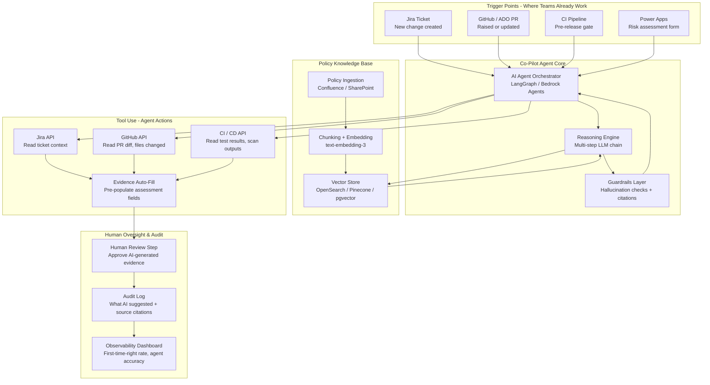

# Idea 4 — Agentic Risk & Release Co-Pilot ✅ SELECTED

> **Sponsor**: Ritu Sinha / Ali Ahmed | **Mentor**: Abhishek Kandivalikar
> **My Goal**: Learn Agentic AI + LLM Orchestration through a real enterprise governance problem

---

## 📌 Action Pointers — Where to Start When You Return

### Immediate First Steps
- [ ] **Email Mentor (Abhishek Kandivalikar)** — introduce yourself, confirm selection, ask for a 30-min kick-off call
- [ ] **Key question to ask first**: *"Which LLM service is approved — Azure OpenAI, AWS Bedrock, or GCP Vertex AI? Can we use it today or does it need procurement?"*
- [ ] **Read up on**: [LangGraph](https://langchain-ai.github.io/langgraph/) and [AWS Bedrock Agents](https://docs.aws.amazon.com/bedrock/latest/userguide/agents.html) — the two most likely agent frameworks

### Top 3 Technical Skills to Build First
1. **RAG (Retrieval-Augmented Generation)** — build a simple policy Q&A bot as a warm-up exercise
2. **LLM Tool Use / Function Calling** — teach an LLM to call the Jira API to fetch ticket context
3. **LangGraph** — multi-step agent orchestration with state management and human-in-the-loop

### Key Technical Decisions to Pin Down Early
- [ ] Which tools are the **primary integration targets**? (Jira first? GitHub PR? Power Apps?)
- [ ] Is the agent **proactive** (pushes guidance on new ticket/PR) or **reactive** (answers when asked)?
- [ ] What is the **approved vector store** for the policy knowledge base? (OpenSearch, pgvector, Pinecone?)

### Your Learning Milestones
- **Week 1–2**: Build a simple RAG prototype — ingest 3 policy PDFs, ask questions against them
- **Week 3–4**: Add tool use — agent calls Jira API to read a ticket, combines with policy RAG answer
- **Week 5–6**: Add LangGraph state machine — multi-step reasoning with human approval gate
- **Week 7+**: Wire to real Jira / GitHub PR webhook — live agent in a pilot team

### Avoid These Pitfalls
- ⚠️ Don't start building until you know the approved LLM — this is the single biggest blocker
- ⚠️ Design the **guardrails and citation layer first** — wrong policy advice is worse than no tool
- ⚠️ Keep humans in the loop for the pilot — don't try to fully automate on first release

---

## 📋 From the Brief

| Field | Detail |
|---|---|
| **Title** | Agentic Risk & Release Co-Pilot |
| **Sponsor** | Ritu Sinha / Ali Ahmed |
| **Mentor** | Abhishek Kandivalikar |
| **Core Problem** | Teams spend significant time **navigating policies, chasing requirements, and manually assembling artefacts** for risk and release assessments. Policy guidance is often late, inconsistent, and disconnected from the tools teams use daily. This creates frustration, delays, and errors as teams interpret requirements differently or miss critical steps. |
| **Impact** | Delivery teams losing productivity to administrative tasks; risk teams providing repetitive guidance; governance teams dealing with incomplete or incorrect submissions. |
| **Consequences** | Extended cycle times, reduced first-time-right rates, team dissatisfaction with governance processes. |
| **Urgency** | Need to scale governance without proportionally scaling overhead, and to improve developer experience of compliance activities. |

### Proposed Scope (from brief)
- Create an **intelligent assistant that understands policy requirements** and provides contextual guidance within teams' existing workflows
- Build **policy knowledge bases**
- Pre-fill evidence from available sources
- Provide in-context coaching across tools: **Jira, PR, CI, Power Apps**
- Maintain auditability with human oversight
- Stand-alone elements: policy corpus development, evidence auto-completion, pre-flight advisory capabilities, release guidance features

### Benefits
- Development teams receive just-in-time policy guidance where they work
- Customers benefit from faster feature delivery with maintained governance
- Risk teams reduce repetitive advisory activities
- Governance teams receive higher-quality, complete submissions
- Reduced manual field completion through automation
- Faster time-to-production with guided compliance
- Improved first-time-right rates for assessments
- **Measurable AI impact on delivery flow**

---

## 🎓 Why This Could Be the #1 AI Learning Choice

| Skill Area | What You Will Learn |
|---|---|
| **Agentic AI / AI Agents** | Building multi-step reasoning agents using LangChain, AutoGen, or AWS Bedrock Agents — the cutting edge of applied AI |
| **RAG (Retrieval-Augmented Generation)** | Building a policy knowledge base and retrieving the right policy context for a given release/risk scenario |
| **Tool Use & Function Calling** | Teaching the agent to call Jira APIs, GitHub PR APIs, CI pipeline APIs to fetch context and pre-fill forms |
| **LLM Orchestration** | Managing chains of LLM calls with guardrails — LangGraph, LangChain LCEL, or AWS Bedrock Agents |
| **Human-in-the-Loop AI** | Designing AI systems with human oversight, approval gates, and audit trails — critical for regulated banking |
| **Enterprise AI Integration** | Embedding AI into Jira, GitHub, CI/CD, Power Apps — real-world enterprise toolchain integration |
| **Prompt Engineering for Compliance** | Designing prompts that produce accurate, safe, auditable compliance guidance |
| **Observability for AI Agents** | Tracing agent reasoning steps, monitoring hallucination rates, tracking evidence quality |

---

## ❓ Questions for Sponsors (Ritu Sinha / Ali Ahmed) & Mentor (Abhishek Kandivalikar)

### Problem Clarification
1. Which specific risk and release assessment processes are most painful today? (e.g., SNAP/RFC submissions, security risk assessments, operational readiness reviews?)
2. How many assessments does a typical delivery team submit per month? How long does one take end-to-end today?
3. What percentage of submissions come back with "insufficient evidence" or require rework? This is the key baseline metric.
4. Is policy guidance currently centralised in one place (Confluence, SharePoint, intranet) or scattered across multiple sources?
5. What does "chasing requirements" mean in practice — are teams unclear which policies apply to their change, or do they understand the policy but struggle to gather the evidence?

### Scope & Prioritisation
6. Which tools are the primary integration targets for the co-pilot? (Jira, GitHub PR, Azure DevOps CI, Power Apps — what's the priority order?)
7. Should the agent be **proactive** (pushes guidance based on events like a new Jira ticket / PR raised) or **reactive** (answers questions when asked)?
8. Is the scope limited to one type of assessment (e.g., release risk only) or does it span multiple frameworks (security, operational readiness, change management)?
9. What does "human oversight" need to look like — a reviewer approves AI-generated evidence before submission, or just an audit trail of what the AI suggested?
10. Is there an existing Risk/Release management system the agent must integrate with? (e.g., ServiceNow, Archer, a bespoke Power Platform app?)

### AI & Governance Constraints
11. Which LLM service is approved for use in the bank? (Azure OpenAI, AWS Bedrock, Google Vertex AI?) Is any of this approved today, or would this project also need to get AI platform approval?
12. Can policy documents be ingested into a cloud-hosted vector store, or must the RAG index remain on-premises?
13. How do we prevent the agent from giving **wrong or hallucinated policy guidance** — what is the acceptable risk tolerance, and is a "I'm not sure, please contact the risk team" fallback acceptable?
14. Must all AI suggestions be attributed to a source policy document (with a citation) for auditability?

---

## 🏗️ High-Level Solution

### Architecture Overview

### Core Components

| Component | Technology Options | Purpose |
|---|---|---|
| Agent Orchestrator | LangGraph / AWS Bedrock Agents / AutoGen | Manage multi-step reasoning: context → policy retrieval → evidence filling → guidance |
| Policy RAG | LangChain + OpenSearch / Pinecone | Retrieve relevant policy sections based on change type and context |
| Tool Use / Function Calling | LLM function calls → Jira, GitHub, CI APIs | Pull live context about the change to inform evidence pre-fill |
| Evidence Auto-Fill | LLM + structured output (JSON) | Generate pre-populated risk/release form fields with citations |
| Guardrails | NVIDIA NeMo Guardrails / custom | Prevent hallucinations, ensure all claims are cited to source policy |
| Human Review UI | Simple web UI / Power Apps extension | Reviewer approves/rejects AI suggestions before submission |
| Audit & Traceability | Postgres + S3 | Immutable log of every AI suggestion, source policy, reviewer action |
| Observability | Grafana / Langfuse / Datadog LLM traces | Agent accuracy, first-time-right rate, latency, hallucination rate |
| Embedding Model | text-embedding-3 (Azure OpenAI) / Cohere | Convert policy documents to vector embeddings for semantic retrieval |

### 12-Week Delivery Plan

| Phase | Weeks | Focus |
|---|---|---|
| corpus & RAG | 1–3 | Collect and chunk policy documents; build vector index; test retrieval quality on 20 sample scenarios |
| Agent Core | 4–6 | Build orchestrator with tool use (Jira + GitHub APIs); evidence auto-fill prototype; guardrails + citation layer |
| Integration & Pilot | 7–9 | Embed in Jira (plugin or webhook); pilot with one delivery team on a live release; measure first-time-right |
| Scale & Audit | 10–12 | Add CI integration, Power Apps connection, human review UI, full audit trail, observability dashboard |

---

## 📊 Updated Full Ranking (all ideas)

| Rank | Idea | AI | Observability | DevOps | Architecture | Best For |
|---|---|---|---|---|---|---|
| 🥇 **#1** | **Idea 4 — Agentic Co-Pilot** | ⭐⭐⭐ | ⭐⭐ | ⭐⭐ | ⭐ | **Agentic AI, RAG, LLM orchestration** |
| 🥈 **#2** | **Idea 7 — Data Flow Discovery** | ⭐⭐ | ⭐⭐⭐ | ⭐⭐ | ⭐ | **Data observability, lineage, schema** |
| 🥉 **#3** | **Idea 2 — Beyond Documents** | ⭐⭐⭐ | ⭐ | ⭐⭐ | ⭐⭐⭐ | **Architecture-as-code, LLM + KG** |
| **#4** | Idea 10 — Metadata Enhancement | ⭐⭐⭐ | ⭐ | ⭐ | ⭐ | Applied AI, OCR, NLP, vector search |
| **#5** | Idea 3 — Controls-as-Code | ⭐⭐ | ⭐⭐ | ⭐⭐⭐ | ⭐ | DevSecOps, policy-as-code |

> **Key insight about Idea 4:** The word "Agentic" is not accidental. This is the only idea that asks you to build a full **AI agent** — something that reasons, retrieves, acts on tools, and operates with human oversight. That is the most sought-after AI skill in 2025–2026.

---

## 📊 Success Metrics
- First-time-right rate on risk/release submissions → baseline now, target +30% improvement
- Average time to complete a risk assessment → target 50% reduction
- Risk team advisory queries (repetitive questions) → target 40% deflection to the co-pilot
- Agent hallucination/incorrect guidance rate → target <2% (measured by human reviewer corrections)
- Developer experience score on governance process → measurable NPS uplift
