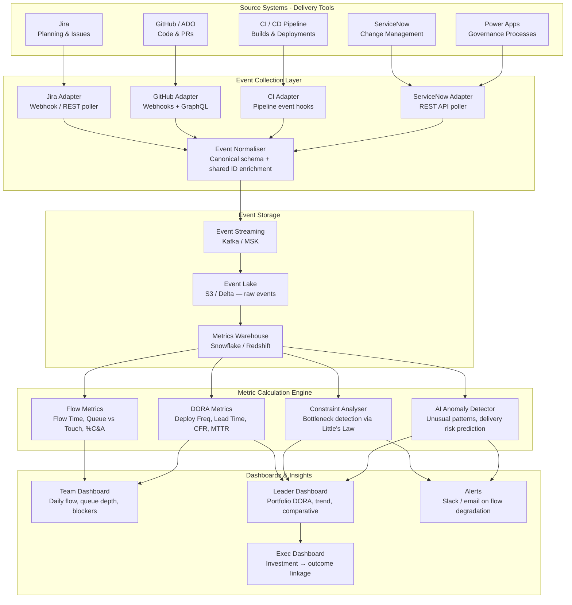

# Idea 5 — Integrated Flow Metrics Fabric

> **Learning Ranking: #1 for Platform Observability — strongest pure observability idea in the set**
> This idea is entirely centred on **engineering metrics observability** — building a unified data fabric that collects events from Jira, Git, CI, Power Apps, and ServiceNow; calculates standardised flow metrics; and surfaces role-based dashboards. If your primary learning goal is **platform observability, DORA metrics, and data engineering for delivery insight**, this is the highest-value pick alongside Idea 7.

---

## 📋 From the Brief

| Field | Detail |
|---|---|
| **Title** | Integrated Flow Metrics Fabric |
| **Sponsor** | Lynn Howell |
| **Mentor** | Imran Ibrahim |
| **Core Problem** | Visibility into delivery flow is **fragmented across disconnected systems**, making it difficult to identify bottlenecks, measure improvements, or understand end-to-end cycle times. Teams lack standardised metrics and struggle to correlate events across tools (Jira, Git, CI, Power Apps, ServiceNow). This fragmentation prevents data-driven decision-making and makes it impossible to prove whether changes actually improve flow. |
| **Impact** | Delivery teams unable to see their own constraints; leaders making decisions without data; improvement initiatives unable to demonstrate value. |
| **Consequences** | Wasted effort on non-constraining activities; inability to predict delivery timelines; missed opportunities for optimisation. |
| **Urgency** | Need to improve flow predictability and the investment in improvement initiatives that lack measurable outcomes. |

### Proposed Scope (from brief)
- Establish a **unified data foundation** for flow metrics across the delivery lifecycle
- Standardise event schemas across tools
- Enforce shared identifiers across systems
- Build common event storage
- Define **semantic metrics**: Flow Time, Queue vs Touch Time, %C&A (Percent Complete & Accurate), **DORA metrics** (Deployment Frequency, Lead Time for Changes, Change Failure Rate, MTTR)
- Deliver role-based dashboards
- Stand-alone elements: event schema definition, system adapters, metric calculation engines, dashboard frameworks, constraint review processes

### Benefits
- Delivery teams gain visibility into their flow and constraints
- Leaders make data-driven decisions about improvement investments
- Improvement initiatives demonstrate measurable impact
- Standardised metrics enable meaningful comparisons
- Reduced wait time at identified constraints
- Improved delivery predictability
- Better resource allocation based on actual bottlenecks
- Customers benefit from faster, more predictable delivery

---

## 🎓 Why This is a Top Observability Learning Choice

| Skill Area | What You Will Learn |
|---|---|
| **DORA Metrics** | Deployment Frequency, Lead Time for Changes, Change Failure Rate, MTTR — the industry standard for engineering performance |
| **Flow Metrics** | Flow Time, Queue Time vs Touch Time, Flow Efficiency, %C&A — Theory of Constraints applied to software delivery |
| **Event Schema Design** | Designing shared identifiers and canonical event schemas across heterogeneous tools |
| **Data Engineering / ETL** | Building adapters for Jira, GitHub, CI, ServiceNow; normalising and enriching events in a data pipeline |
| **Analytics & Dashboarding** | Building role-based dashboards (team vs. leader vs. exec) with Grafana, PowerBI, or Metabase |
| **Bottleneck Analysis** | Using Little's Law and flow analysis to identify where work is waiting vs. actively being worked |
| **Stream Processing** | Real-time event collection and metric calculation using Kafka + Flink or similar |
| **AI for Anomaly Detection** | ML models to flag unusual flow patterns, predict delivery risks, or auto-identify constraint points |

---

## ❓ Questions for Sponsor (Lynn Howell) & Mentor (Imran Ibrahim)

### Problem Clarification
1. Which tools are the primary sources of truth for each phase of delivery today? (Jira for planning, GitHub for code, Jenkins/Azure DevOps for CI/CD, ServiceNow for change/release, Power Apps for governance?)
2. Do teams currently track any metrics at all — even informally? (e.g., sprint velocity, deployment counts, incident counts?) What's the starting point?
3. What does "end-to-end cycle time" mean in this context — from idea/ticket creation to production deployment? Or a narrower slice (e.g., code commit to deployment)?
4. Is the primary audience for dashboards **delivery teams** (so they can see their own constraints) or **leaders** (for portfolio-level visibility) or both?
5. What are the top 3 decisions that leaders would make differently if they had these metrics? This helps prioritise which metrics matter most.

### Scope & Prioritisation
6. How many value streams / teams would be in scope for the pilot? What makes a good pilot candidate?
7. Are there existing shared identifiers across tools (e.g., a Jira ticket ID referenced in a commit message and a ServiceNow change)? Or does shared correlation need to be established from scratch?
8. Should the metrics be real-time (live dashboards) or acceptable at daily/weekly granularity for the initial version?
9. Which DORA metrics are most urgent — is Deployment Frequency already tracked, or is even that unknown today?
10. Is there a preference for a commercial flow metrics platform (Sleuth, LinearB, Faros.ai, Jellyfish) vs. a custom-built solution?

### Technical Constraints
11. What is the existing observability/analytics stack? (Grafana, Datadog, Splunk, Power BI?) Any standardisation across teams?
12. Are Jira and ServiceNow hosted on-premises or cloud? What API access is available?
13. What is the data retention requirement for raw events — 90 days? 1 year? 3 years? This affects storage architecture.
14. Is there a need for metric calculation to be **auditable** — i.e., traceable back to individual events, so a disputed metric can be explained?

---

## 🏗️ High-Level Solution

### Architecture Overview

### Core Components

| Component | Technology Options | Purpose |
|---|---|---|
| Source Adapters | Custom webhooks / REST pollers / Jira/GitHub Apps | Collect raw events from each tool in near real-time |
| Event Normaliser | Python / Flink / Kafka Streams | Enforce canonical schema, add shared identifiers, enrich with team/value-stream metadata |
| Event Lake | S3 + Delta / Iceberg | Raw event storage with immutable audit trail |
| Metrics Warehouse | Snowflake / Redshift / dbt | Aggregated, pre-calculated metrics for fast dashboard queries |
| DORA Calculator | dbt models / Python | Deployment Frequency, Lead Time, CFR, MTTR per team/service |
| Flow Metrics Engine | Python / Spark | Flow Time, Queue vs Touch time, %C&A, Flow Efficiency per value stream |
| AI Anomaly Detector | Prophet / sklearn / LLM | Detect delivery risk patterns, predict constraint emergence |
| Dashboards | Grafana / PowerBI / Metabase | Role-based views: team (daily), leader (weekly), exec (monthly) |
| Alerting | Slack / PagerDuty via Grafana | Alert on flow degradation, DORA regression, constraint spikes |

### 12-Week Delivery Plan

| Phase | Weeks | Focus |
|---|---|---|
| Audit & Schema Design | 1–3 | Inventory tools and available APIs; design canonical event schema; define shared identifiers; select pilot value stream |
| Adapters & Ingestion | 4–6 | Build adapters for Jira + GitHub + CI; stand up event lake and streaming layer; validate data completeness |
| Metric Engine | 7–9 | Build DORA and Flow metric calculations (dbt models); validate metrics against manual counts; constraint analysis |
| Dashboards & Insights | 10–12 | Build team + leader dashboards; add AI anomaly detection; publish pilot results and bottleneck analysis |

---

## 📊 How Idea 5 Fits the Full Ranking

| Rank | Idea | AI | Observability | DevOps | Best For |
|---|---|---|---|---|---|
| 🥇 | **Idea 4 — Agentic Co-Pilot** | ⭐⭐⭐ | ⭐⭐ | ⭐⭐ | Agentic AI, LLM orchestration |
| 🥈 | **Idea 7 — Data Flow Discovery** | ⭐⭐ | ⭐⭐⭐ | ⭐⭐ | Data lineage, schema registry |
| **~#2** | **Idea 5 — Flow Metrics Fabric** | ⭐⭐ | ⭐⭐⭐ | ⭐⭐⭐ | **Engineering metrics, DORA, delivery observability** |
| 🥉 | **Idea 2 — Beyond Documents** | ⭐⭐⭐ | ⭐ | ⭐⭐ | Architecture-as-code, Knowledge Graphs |
| #4 | Idea 10 — Metadata Enhancement | ⭐⭐⭐ | ⭐ | ⭐ | OCR, NLP, vector search |
| #5 | Idea 3 — Controls-as-Code | ⭐⭐ | ⭐⭐ | ⭐⭐⭐ | Policy-as-code, DevSecOps |

> **Idea 5 vs Idea 7:** Both are observability-heavy. Idea 7 focuses on **data flow and lineage** (data engineering skill). Idea 5 focuses on **delivery metrics and DORA** (engineering productivity/platform engineering skill). Both are excellent — pick based on whether you want to go deeper into data platform engineering (Idea 7) or delivery performance / SRE-adjacent skills (Idea 5).

---

## 📊 Success Metrics
- DORA metrics baseline published for pilot value stream within 8 weeks
- Reduction in manual metric gathering effort → target 80% reduction (eliminate spreadsheets)
- Flow efficiency improvement in pilot teams → measurable quarter-on-quarter
- Leader decision confidence: qualitative survey before/after
- Number of improvement initiatives with measurable flow impact → target all initiatives tracked
