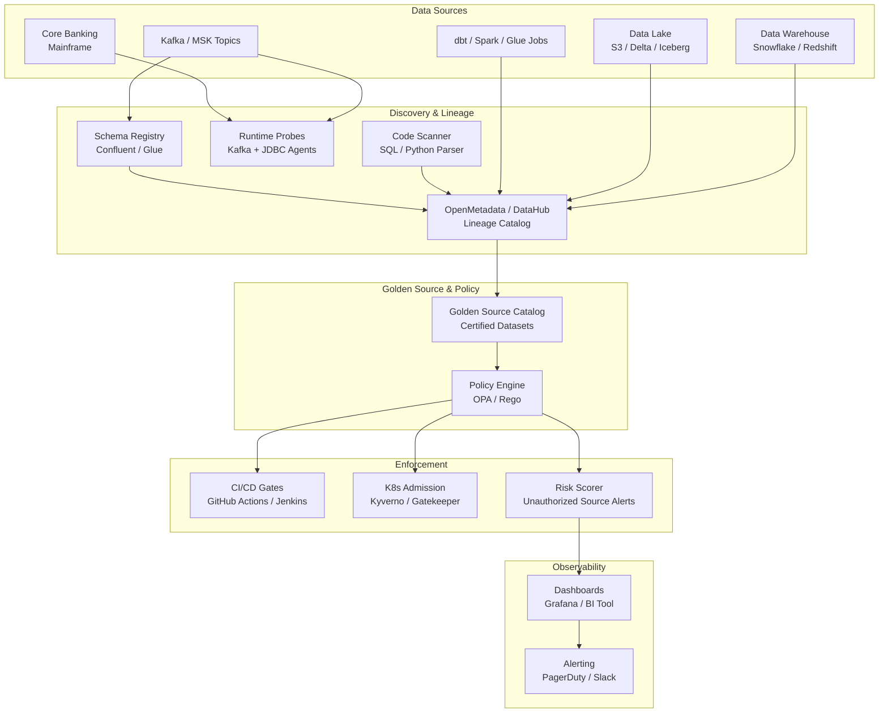

# Idea 7 — Bank-wide Data Flow Auto-Discovery & Golden-Source Guardrails

> **Ranking: #1 for Learning (AI + Observability)**
> This idea is directly centred on **data observability** — understanding what data flows where, from which sources, and enforcing trust. It is the foundational skill for any senior data or platform engineer.

---

## 📋 From the Brief

| Field | Detail |
|---|---|
| **Title** | Bank-wide Data Flow Auto-Discovery & Golden-Source Guardrails |
| **Sponsor** | Dawn Trinder |
| **Mentor** | Nelson Yap |
| **Core Problem** | Data flows across the organisation are **opaque**. Teams may unknowingly consume data from non-authoritative systems, leading to data quality issues, inconsistencies, and increased operational risk. The lack of visibility makes it difficult to understand data lineage, assess the impact of changes, or enforce data governance policies. |
| **Impact** | Development teams make uninformed sourcing decisions; data teams cannot ensure quality; risk teams face data-related incidents; compliance risks from ungoverned data usage; incidents caused by consuming stale or incorrect data. |
| **Urgency** | Regulatory requirements for data lineage (BCBS 239 / FCA); operational impact of data quality issues. |

### Proposed Scope (from brief)
- Passive and active flow discovery mechanisms
- Golden source cataloguing, matching and risk scoring
- Preventative checks (enforcement hooks)
- Stand-alone elements: discovery tooling (schema registry integration, lineage scanning, runtime probes), golden source catalog, risk assessment frameworks, and policy enforcement hooks.

### Benefits
- Development teams make informed data sourcing decisions
- Data teams ensure consumption from authoritative sources
- Risk teams reduce data-related incidents
- Better understanding of data lineage and dependencies
- Reduced compliance risk from ungoverned data usage
- Faster impact assessment for data source changes
- Customers benefit from consistent, high-quality data in services

---

## 🎓 Why This is the #1 Learning Choice

| Skill Area | What You Will Learn |
|---|---|
| **Data Observability** | How to instrument data pipelines for visibility — the foundation of modern data engineering |
| **Data Lineage** | Column-level and dataset-level lineage tracking using tools like OpenMetadata, Collibra, Apache Atlas |
| **Schema Registry** | Confluent or AWS Glue Schema Registry; versioning, compatibility checks, CI/CD enforcement |
| **Policy-as-Code** | OPA/Rego to write and enforce data governance policies programmatically |
| **Real-Time vs Batch Discovery** | Kafka consumer group monitoring, Flink job lineage, dbt graph analysis |
| **Observability Dashboards** | Grafana / BI for lineage completeness, unauthorized usage, freshness SLOs |
| **ML for Data Quality** | Anomaly detection on schema drift, statistical profiling, ML-assisted golden source matching |

---

## ❓ Questions for Sponsor (Dawn Trinder) & Mentor (Nelson Yap)

### Problem Clarification
1. Which data platforms are currently in scope? (Kafka/MSK, Snowflake/Redshift, S3/Delta, Oracle mainframe feeds?)
2. Is there an existing data catalog or lineage tool deployed today? (Collibra, Alation, DataHub, OpenMetadata?)
3. What does "golden source" mean today — is it a certified data product, a data owner's attestation, or a policy tag in a catalog?
4. Are there any BCBS 239 or FCA lineage reporting obligations already in flight that this would support?
5. What is the definition of "non-authoritative" consumption — consuming from a replica, a stale cache, or a domain-external system?

### Scope & Prioritisation
6. Which domains are highest priority for the pilot? (Payments, Customer Master, Risk?)
7. Should enforcement start as **advisory** (flag violations) or immediately **preventative** (block bad sourcing in CI/CD)?
8. Which CI/CD platforms are in use? (GitHub Actions, Jenkins, Azure DevOps?) This affects where we embed enforcement hooks.
9. Are mainframe / COBOL feeds in scope, or only modern stacks initially?
10. Is there a regulatory deadline that sets the urgency level?

### Technical Constraints
11. Do teams currently register schemas before publishing Kafka topics? Or is schema evolution uncontrolled?
12. Is there a preference for open-source tooling (OpenMetadata + OPA) vs vendor (Collibra + Informatica)?
13. What observability stack is already in place? (Prometheus, Grafana, DataDog, Splunk?)
14. How are data ownership and stewardship currently assigned — by team, domain, or data contract?

---

## 🏗️ High-Level Solution

### Architecture Overview

### Core Components
| Component | Technology Options | Purpose |
|---|---|---|
| Schema Registry | Confluent / AWS Glue Schema Registry | Enforce schema contracts on all Kafka events |
| Lineage Catalog | OpenMetadata / DataHub / Collibra | Central view of data lineage, ownership, quality |
| Runtime Probes | Kafka Consumer Agents / JDBC Wrappers | Detect unregistered data consumers at runtime |
| Policy Engine | OPA + Rego bundles | Enforce golden-source access policies |
| CI/CD Gates | GitHub Actions / Jenkins Plugins | Block builds when schemas unregistered or lineage incomplete |
| Observability | Grafana + Prometheus / DataDog | Lineage coverage %, unauthorized source usage, freshness SLOs |
| ML Enrichment | Python + Great Expectations / Soda | Statistical profiling, anomaly detection on schema drift |

### 12-Week Delivery Plan
| Phase | Weeks | Focus |
|---|---|---|
| Discovery | 1–2 | Inventory platforms, choose pilot domain, select tooling |
| Foundation | 3–5 | Deploy catalog + schema registry; connect to Kafka + dbt/Glue |
| Pilot Enforcement | 6–9 | CI/CD checks, advisory risk scoring, publish golden dataset list |
| Guardrails to Prevent | 10–12 | Block non-registered schemas in non-prod, dashboards live |

---

## 📊 Success Metrics
- % data products with certified golden source tag → target >80% in pilot domains
- % Kafka topics/tables with registered schema and lineage → target >90%
- Unauthorized consumption incidents → trending down monthly
- Time to assess impact of a schema change (baseline vs. after)
