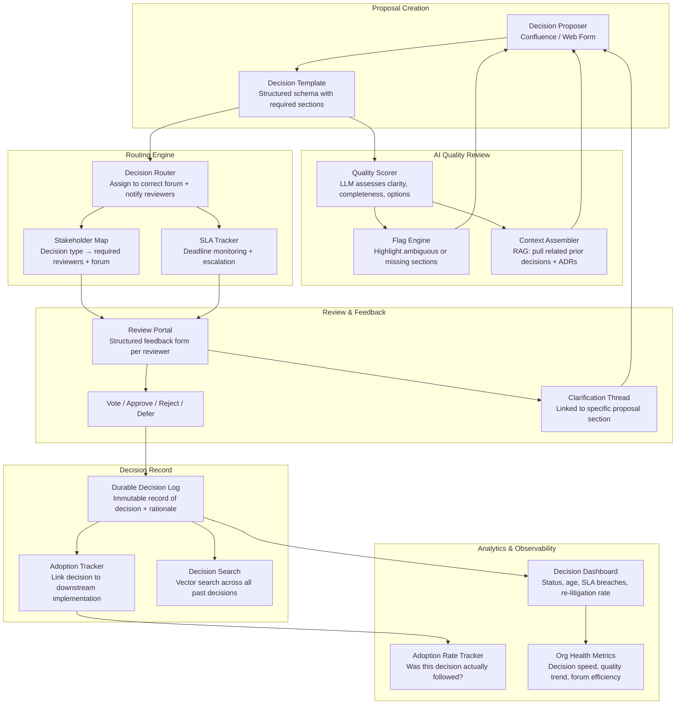

# Idea 8 — Intelligent Syndication & Decision Quality Automation

> **Sponsor**: Denis Ontiveros Merlo | **Mentor**: Darren Briddle
> **Learning Ranking: #4 — AI orchestration meets governance workflow; strong process + LLM skills**

---

## 📋 From the Brief

| Field | Detail |
|---|---|
| **Title** | Intelligent Syndication & Decision Quality Automation |
| **Sponsor** | Denis Ontiveros Merlo |
| **Mentor** | Darren Briddle |
| **Core Problem** | Decision syndication is slow, inconsistent, and labour-intensive. Decisions lack structured context, making it difficult to route to appropriate stakeholders, assess quality, or maintain durable records. Teams spend significant time assembling decision packages and chasing approvals, while governance forums struggle with incomplete information and re-litigation of previously decided topics. |
| **Impact** | Delivery teams waiting for decisions; architects managing syndication overhead; governance forums reviewing poorly structured proposals. |
| **Consequences** | Extended decision cycles, repeated discussion of the same topics, difficulty auditing decision rationale. |
| **Urgency** | Volume of decisions requiring governance; risk of poor decisions made without proper context or stakeholder input. |

### Proposed Scope (from brief)
- Structure and accelerate decision-making through intelligent assistance and quality automation
- Codifying decision patterns and stakeholder maps
- Creating AI-assisted context assembly
- Automating routing to appropriate forums
- Scoring decision quality
- Maintaining durable decision logs
- Stand-alone elements: decision schema definition, quality rubrics, routing rules, dossier generation, AI review capabilities, governance integration

### Benefits
- Delivery teams experience faster decision cycles
- Architects reduce syndication overhead
- Governance forums receive well-structured, complete proposals
- Reduced time from decision request to resolution
- Lower re-litigation rate through better initial quality
- Improved completeness and consistency of decisions
- Auditable decision rationale and stakeholder engagement
- Customers benefit from faster delivery enabled by efficient governance

---

## 🎯 Sponsor's Vision — What They Actually Want

> *"It's about faster decisions, but it's also about **better decisions**, and a better decision is one that actually gets adopted."*
> — Sponsor Context

### The Real Problem (in the Sponsor's Words)

**1. Syndication is broken by design:**
- Getting anything done in the bank takes *"literally months and months of syndication"* so everyone is comfortable — and *even then*, adoption isn't there.
- The firm has multiple layers of governance that have grown over time. Nobody will challenge them because *"who are we to go and say that?"*

**2. "Tourists in meetings":**
- 50 people in a meeting trying to make a cohesive decision. Most are observers, not decision-makers.
- No clarity on *"who are the SMEs and the people that actually need to be involved"*.

**3. No visibility on decision status:**
- *"Hey, where are we on that container strategy? It's been six months and I haven't heard anything. Who's on the hook for that?"*
- People on the ground are unaware of decisions that have been made.
- No systematic capture of feedback, clarification, or resolution.

**4. Poor decision quality leads to poor adoption:**
- Decisions are not adopted because they were not properly syndicated from the start.
- The current measurement (pulse rates/surveys) shows the firm is *"really slow at decisions"*.

### The Sponsor's Vision (Target State)
- A **systematic, declarative process**: *"I've got a problem to solve. Who are the SMEs? Have that explicitly and declaratively there."*
- Material gets to the right people, feedback is captured systematically, and you always know where you are in the process.
- **AI-assisted quality review**: proposals that are unclear get flagged before they reach the forum — *"that statement you created wasn't very clear, so you need to rewrite it"*.
- **Decisions that get adopted** — not just made.

---

## 🎓 Learning Value

| Skill Area | What You Will Learn |
|---|---|
| **AI for Quality Scoring** | LLMs assessing proposal quality: clarity, completeness, stakeholder coverage |
| **RAG for Context Assembly** | Automatically assembling relevant prior decisions, ADRs, and policies as context for a new proposal |
| **Workflow Automation** | Building structured decision workflows with state machines and routing logic |
| **Knowledge Graphs** | Modelling stakeholder maps, decision patterns, and governance forum structures |
| **NLP / Text Analysis** | Detecting ambiguity, missing sections, contradictions in decision proposals |
| **Decision Intelligence** | Measuring decision speed, quality, adoption rate — a new analytics discipline |
| **Governance Integration** | Integrating with Jira, Confluence, ServiceNow, or SharePoint for real-world workflow embedding |

---

## ❓ Questions for Sponsor (Denis Ontiveros Merlo) & Mentor (Darren Briddle)

### Directly Addressing the Sponsor's Framing

**On "tourists in meetings" and routing:**
1. Is there a documented list of governance forums and their remit today (Architecture Council, Security Forum, Change Advisory Board, etc.)? Or is that itself something to be established?
2. What determines which forum a decision goes to — is there a documented routing rule, or is it currently based on informal judgment and relationships?
3. Who decides who the required stakeholders are for a given decision? Is there a RACI or stakeholder map, even partially, for decision types?

**On decision quality and proposal clarity:**
4. What does a "good" decision proposal look like today — is there a template, or is it freeform? What sections are expected?
5. Are there examples of decisions that were rejected or sent back because the proposal was unclear? Can these be used to train/calibrate a quality rubric?
6. Is re-litigation a documented problem — are there specific decisions that have been discussed in multiple forums without resolution? This would be a great pilot case.

**On decision status and tracking:**
7. Where are decisions currently recorded? (Confluence pages, Word docs, email chains, SharePoint, a dedicated tool?) Is there any single source of truth, even partial?
8. How would you define "a decision is complete"? Is it: a forum voted; a document was published; an email was sent; something changed in a system?
9. What is the acceptable SLA for different decision types? (e.g., architectural decisions: 2 weeks; security exceptions: 5 days?)

**On adoption:**
10. Is there a way to measure today whether a decision was actually adopted — or is this also unmeasured? (e.g., a decision to use a specific cloud pattern — how do we know if teams followed it?)
11. Should the system send reminders/nudges to stakeholders who haven't provided feedback by a deadline?

**On AI and tooling:**
12. Is there a preferred platform to embed this into (Jira, Confluence, ServiceNow, Power Platform, or a standalone tool)?
13. What is the sensitivity of decision documents — can they be processed by cloud LLMs for quality scoring and context assembly?

---

## 🏗️ High-Level Solution

### The Core Model: Decision-as-a-Structured-Object

The fundamental shift: a decision stops being a Word document or email chain and becomes a **structured, tracked, routable object** — like a Jira ticket, but for governance decisions.

```yaml
# Example decision schema
decision:
  id: DEC-2024-0892
  title: "Container orchestration strategy — shift to EKS"
  status: in_review               # draft | in_review | approved | rejected | superseded
  type: architectural              # architectural | security | process | regulatory
  proposer: team@davies.com
  created: 2024-11-01
  sla_days: 14
  
  context:
    problem_statement: "..."
    options_considered:
      - option: "EKS"
        pros: "..."
        cons: "..."
      - option: "ECS"
        pros: "..."
        cons: "..."
    recommended_option: "EKS"
    rationale: "..."
    
  routing:
    required_forum: architecture_council
    required_reviewers:
      - role: cloud_architect
        name: TBD
        status: pending
      - role: security_lead
        name: TBD
        status: approved
    optional_observers: []

  quality_score:
    overall: 72                   # AI-generated quality score
    flags:
      - field: rationale
        issue: "Rationale does not address cost implications"
      - field: options_considered
        issue: "Only 2 options — consider adding status quo as baseline"

  audit_trail:
    - timestamp: 2024-11-01T10:00Z
      event: created
    - timestamp: 2024-11-03T14:30Z
      event: quality_review_flagged
      detail: "2 quality flags raised by AI review"
```

### Architecture Overview



### Core Components

| Component | Technology Options | Purpose |
|---|---|---|
| Decision Schema | YAML / JSON stored in Postgres | Structured object model for a decision with all required sections |
| Decision Portal | React web app / Confluence macro / Power App | Where proposers create and reviewers respond |
| Quality Scorer | GPT-4 / Gemini + rubric-based prompts | Score proposal quality; flag ambiguity, missing sections, weak rationale |
| Context Assembler (RAG) | LangChain + OpenSearch vector index | Surface related prior decisions and ADRs automatically |
| Stakeholder Map | Graph DB (Neo4j) or structured config | Decision type → required reviewers + governance forum |
| Routing Engine | Python state machine / Temporal.io | Route decisions, enforce SLAs, trigger reminders |
| Review Portal | Simple form UI with section-level commenting | Structured feedback, vote tracking, clarification threads |
| Decision Log | Postgres + S3 (immutable archive) | Durable record of every decision, version, and rationale |
| Decision Search | OpenSearch with vector embeddings | "Has this been decided before?" semantic search |
| Analytics Dashboard | Grafana / PowerBI | Decision age, SLA compliance, re-litigation rate, adoption rate |

### 12-Week Delivery Plan

| Phase | Weeks | Focus |
|---|---|---|
| Discovery & Schema | 1–3 | Map 3–5 governance forums and their remit; define decision schema; inventory existing decision-making patterns; select pilot forum (e.g., Architecture Council) |
| Portal & Routing | 4–6 | Build decision creation form; implement routing engine + stakeholder map; SLA tracker; basic status dashboard |
| AI Quality + RAG | 7–9 | Integrate LLM quality scorer + flag engine; build RAG context assembler from existing Confluence decisions; test with real proposals |
| Analytics & Scale | 10–12 | Adoption tracker; decision search; full analytics dashboard; pilot results published; operating model documented |

---

## 📊 Success Metrics — Mapped to Sponsor's Goals

| Sponsor Goal | Metric | Target |
|---|---|---|
| Faster decisions | Average time from decision proposal to resolution | Reduce by 50% in pilot forum |
| Better decisions (adopted) | % of approved decisions with measurable adoption evidence | Establish baseline; improve quarter-on-quarter |
| No tourists in meetings | Average number of reviewers per decision (required vs. actual) | Reduce unnecessary attendees by 40% |
| Reduce re-litigation | % of decisions re-opened within 6 months | Baseline and trend down |
| Quality of proposals | Average AI quality score at first submission | Trend up as proposers learn the model |
| Visibility | % of in-flight decisions with current status visible in dashboard | 100% — all tracked |
