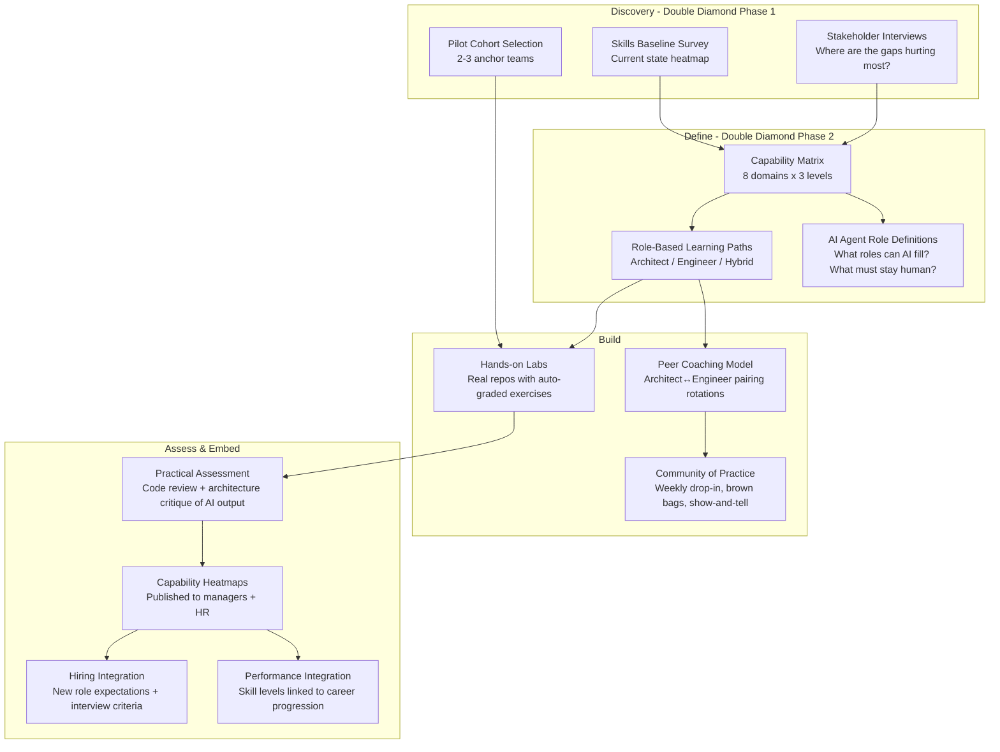

# Idea 9 — Architect ↔ Engineer AI Skills Continuum for the Spec-Driven Era

> **Sponsor**: Nanda Ronanki | **Mentor**: Kevin Connolly
> **Learning Ranking: #5 in technical AI/observability terms — but #1 in personal career impact if you want to lead the design of AI skills frameworks for the organisation**

---

## 📋 From the Brief

| Field | Detail |
|---|---|
| **Title** | Architect↔Engineer AI Skills Continuum for the Spec-Driven Era |
| **Sponsor** | Nanda Ronanki |
| **Mentor** | Kevin Connolly |
| **Core Problem** | The increasing adoption of specification-based development, platform contracts, and policy-as-code is blurring traditional boundaries between architect and engineer roles, yet skills and career paths remain siloed. Engineers lack architectural thinking and influencing skills, while architects lack hands-on experience with modern tooling and practices. |
| **Impact** | Delivery teams with suboptimal collaboration; individuals with limited career progression; the organisation with underutilised talent. |
| **Consequences** | Slower delivery, lower quality architectural decisions, difficulty attracting and retaining talent. |
| **Urgency** | Rapid evolution of development practices and the competitive need for versatile technical talent. |

### Proposed Scope (from brief)
- Define and develop a converged skill set for the specification-driven era
- Create pathways for engineers and architects to develop complementary capabilities
- Target skills stack: architecture-as-code, policy-as-code, runtime conformance, flow literacy, decision framing, influencing
- Creating hands-on learning experiences, mapping career pathways, establishing communities of practice
- Capability frameworks, practical labs tied to real assignments, learning path definition, peer coaching models
- Capability heatmaps integrated into performance and hiring

---

## 🎯 Mentor's Pitch — What They Actually Want (Kevin Connolly, verbatim)

> *"AI, we've talked about it a lot. The focus of this assignment is understanding the skills evolution we need to embrace in order to fully embed AI in what we do."*

### The Two-Part Challenge Kevin Described

**Part 1: Skills uplift for today**
> *"We need to recognise the pace that things are moving at. People need to be up to speed on AI — but can we break that down and make it more tangible? When you're looking at AI, you need to be able to do X, Y and Z to be well versed in that field."*

The status quo of "everyone explore AI" is too vague. The deliverable is a **specific, tangible AI skill set** broken down by role and proficiency level.

**Part 2: The critical evaluation problem — for the future**
> *"A big part of what we do as architects and engineers is owning the output that AI creates — being able to critically evaluate the code that's been produced, the tests, what it's chosen to implement. We can do that because we've had years of experience actually doing coding, doing architecture. How do we think about the next generation coming through? If you haven't had a background in doing architecture or engineering — how would you know how to critically evaluate what has come out from the AI engines?"*

This is a **profound generational challenge**: AI is making it possible to generate code without deeply understanding code. The next generation of architects and engineers may never learn the fundamentals — so when the AI gets it wrong, they won't know.

**Part 3: AI agents as team members**
> *"We want to give AI agents defined roles alongside us in the teams with our architects and our engineers."*

Not just AI as a tool — AI as a **role** within a team. The skill set includes knowing how to direct, verify, and collaborate with an AI agent teammate.

**On deliverables (Kevin's response to Verinda's question):**
> *"Double diamond approach — explore the problem space, work out where the real nuggets are. Could be specific skills interventions, specific training. Can we look at the AI-enabled skillset that people need? Where do we risk eroding skills that we still need? We need some sort of plan or strategy to make sure those skills don't disappear."*

---

## 🎓 Why This Is Unique Among the Ideas

This is the **only people/skills idea** in the set. Most of the other ideas are about building systems. This one is about building human capability. That makes it different:

| Dimension | Technical Ideas (1,3,4,5,7) | **Idea 9** |
|---|---|---|
| Primary output | Working software system | Skills framework + learning programmes |
| AI usage | Build AI systems | Learn *to work with* AI systems |
| Stakeholder | Engineering/architecture teams | HR, L&D, senior leadership, every engineer |
| Longevity | System built once, maintained | Living programme, continuously evolved |
| Career impact | Deep technical expertise | Organisational influence + L&D leadership |

---

## ❓ Questions for Sponsor (Nanda Ronanki) & Mentor (Kevin Connolly)

### On the Core Problem
1. Kevin mentioned that today we tell people to "explore AI, get up to speed" — but it's too vague. Is there any existing skills taxonomy or AI skills inventory in the firm, even partial? Or is this a blank slate?
2. What does "spec-driven era" mean concretely at Davies? Is it specifically about Architecture-as-Code (like the CNI DSL from Idea 1), policy-as-code (like Idea 3), or a broader shift?
3. When Kevin talks about AI agents having "defined roles in teams" — is there a specific role model in mind? (e.g., AI agent as code reviewer, AI agent as test writer, AI agent as architecture conformance checker?)

### On the Critical Evaluation Problem
4. Kevin described the risk that next-generation engineers won't have the foundational skills to critically evaluate AI output. Is this a current pain point already (junior engineers accepting AI-generated code without understanding it), or is it a forward-looking concern?
5. How do you keep the "muscle" of deep technical skill alive when AI does the heavy lifting? Is there a deliberate practice model (like surgeons doing simulation even when robots assist) being considered?
6. Should the skills framework explicitly define what humans *must* retain vs. what can be delegated to AI? That would be a powerful output.

### On Deliverables & Scope
7. Kevin described the double diamond approach — does the team have latitude to discover which specific skill interventions would have the biggest return, or are there constraints (budget, time, specific domains to cover)?
8. Are the capability heatmaps to be integrated into **performance reviews** (meaning this affects how people are assessed and promoted)? That changes the stakes significantly.
9. What is the target population size — how many architects and engineers would this programme touch? (Tens? Hundreds? Bank-wide?)
10. Is there an existing Learning Management System (LMS) — Workday Learning, Cornerstone, Degreed — or would the labs and assessments need a new platform?

### On AI Agents as Team Members
11. When Kevin says AI agents should have "defined roles" in teams — does that mean literal Jira tickets assigned to AI agents? Or a more conceptual role definition? What does "accountability" look like for an AI team member?
12. Which AI agent capabilities are most immediately needed in the firm? (Code generation, architecture conformance checking, documentation generation, test writing, security review?)

---

## 🏗️ High-Level Solution

### The Framework: Three Horizons of Skill Evolution

```
Horizon 1: TODAY (0-12 months)        Horizon 2: NEAR (1-3 years)          Horizon 3: FUTURE (3-5 years)
──────────────────────────────         ─────────────────────────────         ──────────────────────────────
"Use AI as a power tool"               "Direct AI as a collaborator"         "Govern AI as a team member"
────────────────────────               ──────────────────────────            ──────────────────────────────
• Prompt engineering                   • Agent orchestration                 • AI role definition
• AI-assisted code review              • Prompt → Spec → Deploy              • Human-AI RACI
• Copilot fluency                      • Evaluating AI architecture          • Skills gap vs. AI capability
• Spotting AI mistakes                 • Multi-agent coordination            • Critical skills preservation
• Architecture-as-code basics          • Policy-as-code authoring            • Next-gen hiring models
```

### Capability Framework

| Skill Domain | Foundation | Practitioner | Expert |
|---|---|---|---|
| **AI Collaboration** | Can use Copilot / ChatGPT for tasks | Can critically evaluate AI output; spots errors and biases | Can design AI agent workflows; define AI team roles |
| **Prompt Engineering** | Writes basic prompts | Engineers structured prompts for consistency | Designs prompt templates; maintains prompt libraries |
| **Architecture-as-Code** | Reads existing DSL/specs | Writes architecture specs; creates branches | Designs DSL extensions; drives intent-to-deploy pipelines |
| **Policy-as-Code** | Understands OPA/Rego examples | Authors and tests Rego policies | Designs control catalogues; governs policy lifecycle |
| **Runtime Conformance** | Understands drift concept | Reads conformance reports; triages alerts | Designs conformance checks; interprets graph diffs |
| **Critical Evaluation** | Can review AI-generated code with guidance | Independently validates AI output across domains | Trains others to evaluate; defines quality rubrics |
| **Influencing & Framing** | Participates in architecture discussions | Presents decisions to peers | Influences senior stakeholders; frames trade-offs |
| **Flow Literacy** | Understands DORA metrics | Can read flow dashboards; identify constraints | Designs flow measurement; runs constraint reviews |

### Programme Architecture



### The AI Agents as Team Members Model

```yaml
# Example: AI Agent Role Definition in a delivery team
ai_agent_role:
  name: "Architecture Conformance Reviewer"
  type: ai_agent
  tool: "Conformance Agent (Idea 1)"
  responsibilities:
    - "Review all PRs for architecture drift against the team's DSL definition"
    - "Flag deviations with explanations before human review"
    - "Generate weekly conformance report for the domain"
  not_responsible_for:
    - "Making final architectural decisions"
    - "Approving production deployments"
    - "Stakeholder communication"
  human_accountable: architecture_lead
  review_cadence: per_PR
  escalation: when_drift_severity == high
```

The capability framework explicitly defines which skills humans **must retain** regardless of AI capability:

| Must Stay Human | Can Be Delegated to AI |
|---|---|
| Ethical judgment on architectural trade-offs | Initial code generation |
| Regulatory accountability | First-pass code review |
| Stakeholder relationship + trust | Documentation generation |
| Critical evaluation of AI output | Test case generation |
| Defining what "good" looks like | Conformance checking |
| Strategic vision and direction | Boilerplate architecture diagrams |

### 12-Week Delivery Plan (Double Diamond)

| Phase | Weeks | Focus |
|---|---|---|
| Discover | 1–2 | Skills baseline survey across architects + engineers; stakeholder interviews; identify top 3 pain points; map AI tool usage today |
| Define | 3–4 | Draft capability matrix (8 domains, 3 levels); AI agent role definitions; pilot cohort selected; learning path design |
| Develop & Pilot | 5–9 | Build 6–8 hands-on labs; run first cohort (20–30 people); peer coaching kicks off; baseline capability heatmap published |
| Scale & Embed | 10–12 | Broader rollout; assessment + heatmaps to managers/HR; hiring integration; community of practice cadence established |

---

## 📊 Success Metrics

| Kevin's Goal | Metric | Target |
|---|---|---|
| Tangible AI skill uplift | % of participants reaching Practitioner level in ≥3 domains | >70% after first cohort |
| Critical evaluation capability | % of engineers who can independently identify errors in AI-generated code (assessed) | Baseline, then >80% |
| AI agents with defined roles | Number of AI agent role definitions published and in use in delivery teams | ≥3 role definitions piloted |
| Skills erosion prevention | Core technical skills (architecture review, security analysis) maintained in capability heatmap | No decline in expert-level count |
| Career progression clarity | % of architects/engineers who say they have a clear AI-enabled career path | Measure via survey; target >75% |
