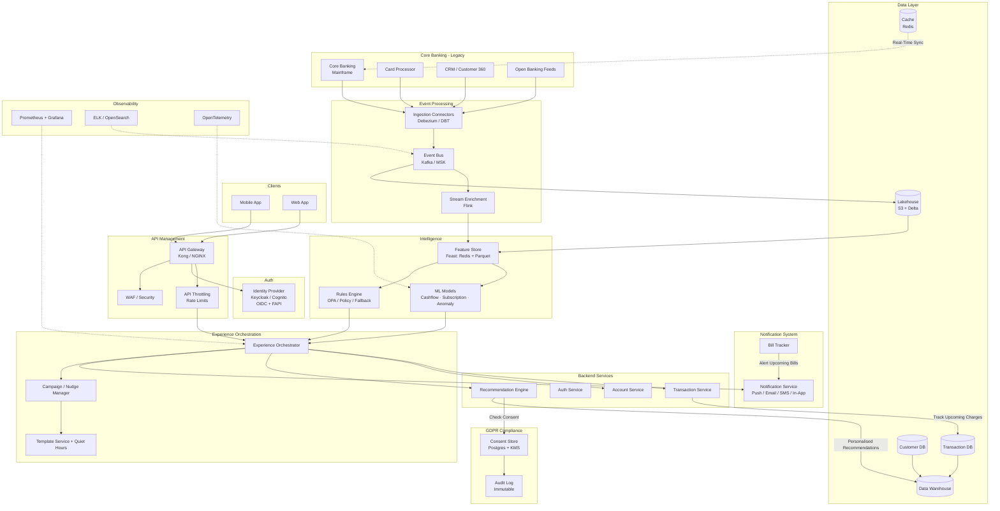
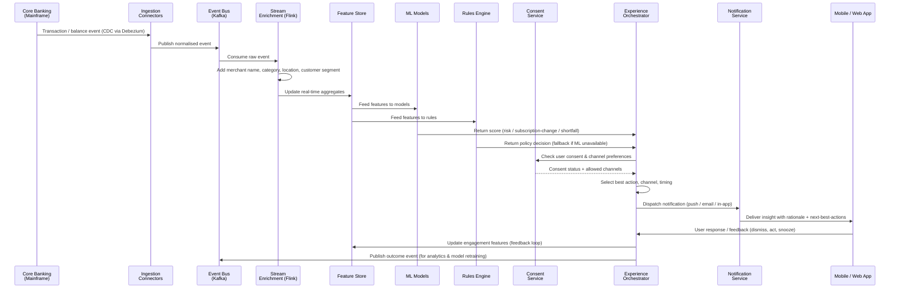
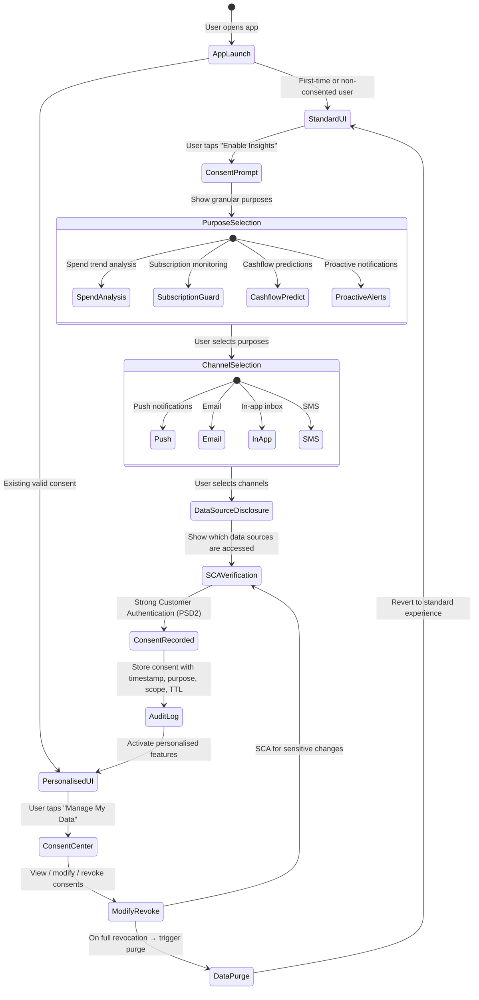

# Module 1 Case Study — Hyper-Personalized Retail Banking Experience

---

## 1. Problem Statement

### 1.1 Customer Empathy Map

| **Says** | **Thinks** |
|---|---|
| "The app is just a reporting tool—no personalised experience." | "There's too much irrelevant information." |
| "Precise information isn't readily available." | "This should be a helping tool, not a reporting tool." |
| "I don't have time to analyse my own transactions." | "Transaction descriptions should carry proper explanations." |
| "Money deducted is higher than usual—no explanation." | "Some of these look like fraudulent transactions." |
| "Notifications arrive too late to act on." | "I expect early warnings, not late reports." |
| "The app never reminds me about upcoming payments." | "There should be an app that tells me where to focus." |
| "I've lost money on subscriptions I'd forgotten about." | |
| "The app feels outdated compared to other apps." | |

| **Feels** | **Does** |
|---|---|
| Anxious, stressed, and caught off guard | Skims through notifications without reading |
| Unsupported, frustrated, confused | Procrastinates on acting on notifications |
| Overwhelmed by unrelated information | Sticks to what they know (safety behaviour) |
| Uncomfortable with financial uncertainty | Minimises app usage wherever possible |
| Reactive instead of in control | Calls customer care for information the app should provide |

### 1.2 Problem–Impact–Consequence–Urgency (PICU) Analysis

#### Problem
Current banking apps provide **generic insights, slow warnings, and limited coaching**, leaving customers vulnerable to financial surprises and poor money management. Transaction and behavioural data exists but remains **fragmented, underutilised, and disconnected** from meaningful, event-driven experiences. Apps lack predictive models, personalised nudges, and behavioural intelligence.

Customers expect *precise insights with personalised experience* focussing on spending habits, subscriptions, and persona-specific features—including proactive notifications and coaching—yet banks deliver none of this at scale today.

#### Impact (quantified)
| Metric | Value |
|---|---|
| Customers facing ≥ 1 monthly financial surprise | **67 %** |
| Customers not receiving early warnings | **30 %** |
| Annual UK spend on forgotten subscriptions | **£ 1.4 billion** |
| Gen Z who prefer coaching apps over informational ones | **57 %** |

#### Consequence
- **> 57 %** of the customer base at risk of churn to more adaptive competitors.
- Rising call volumes and operational cost as customers rely on contact centres for information the app should surface proactively.
- Erosion of brand trust and NPS among digitally native segments.

#### Urgency
The UK banking landscape is shifting rapidly. Challenger banks and fintechs are setting new standards for proactive, personalised digital experiences. A quick turnaround is essential to:
1. Protect the existing customer base.
2. Attract and retain newer segments—especially Gen Z.
3. Meet FCA Consumer Duty requirements for fair outcomes and clear communications.

### 1.3 Business Case Summary

| Lever | Estimated Benefit |
|---|---|
| Reduction in unexpected-transaction surprises | ↓ 40 % of monthly surprise incidents over 12 months |
| Subscription savings surfaced per customer per year | £ 120–£ 250 average |
| Support call deflection via proactive in-app resolution | ↓ 25 % call volume |
| NPS uplift from personalised coaching | +15 points within first year |
| Customer retention improvement | ↓ 20 % churn among active digital users |

---

## 2. Stakeholder Insights (Interview Summary)

> Summarised findings from four stakeholder interviews that directly informed the architecture and design constraints.

### Digital Journey & Channel Experience Architect
- Channels: **web and mobile app** for customer enablement.
- UX: Minimal tabs; easy navigation; reusable pattern library.
- Include probes/nudges to encourage customers to check accounts proactively (e.g., upcoming subscriptions, important announcements).
- KPIs: measure engagement via click-through rates, micro-service call counts, session depth.
- Benchmark against competitor banks.

### Customer Insights & Behavioural Analytics
- Include a **Spend Analyser** feature—show trends, not financial advice.
- Separate consent-based flows: users who opt in receive advanced insights; others retain the standard interface.
- Run market analysis before implementation to avoid customer confusion.

### Legacy System & Core Banking
- Core mainframe systems remain **as-is**; build a modern interaction layer on top.
- Use **caching** (e.g., Redis) for faster responses; **asynchronous communication** to prevent system breakage.
- **Real-time sync** between cache and mainframe is essential.
- Reduce load on core systems during peak times (e.g., payday Fridays)—refer to existing heat-map and load-data model.
- Keep core banking focused on core functions; offload enabling features to the new service layer.

### Data Privacy & Compliance
- Follow **UK GDPR** and **EU AI Act** before any AI/ML deployment.
- Consent-first data access; retention policies aligned to legal norms.
- Audit database for consent logs, data archival, and removal.
- Consider **cross-border data retention** requirements.
- Clarify: the app provides behavioural insights, **not** financial investment advice.

---

## 3. Conceptual Architecture

### 3.1 Functional Block Diagram

#### Simplified Overview
```
┌─────────────────┐     ┌──────────────────┐     ┌──────────────────┐
│  Mobile & Web   │────▶│   API Gateway    │────▶│   Experience     │
│    Channels     │     │ (Auth & Security)│     │  Orchestrator    │
└─────────────────┘     └──────────────────┘     └────────┬─────────┘
                                                          │
                                         ┌────────────────┴────────────────┐
                                         ▼                                 ▼
┌─────────────────┐     ┌──────────────────┐     ┌──────────────────┐     ┌──────────────────┐
│  Core Banking   │────▶│   Event Bus      │────▶│  Intelligence    │◀───▶│  GDPR & Consent  │
│    (Legacy)     │     │   (Kafka/MSK)    │     │  (ML & Rules)    │     │     Service      │
└─────────────────┘     └──────────────────┘     └──────────────────┘     └──────────────────┘
```

#### Detailed Component Interconnect

> **Legend:** 🟦 Existing / Legacy &nbsp;&nbsp; � New — built as part of this initiative &nbsp;&nbsp; Numbers = event flow order

```mermaid
flowchart TD
    classDef existing fill:#1e3a5f,stroke:#4a90d9,color:#cce4ff,rx:6
    classDef newComp  fill:#14532d,stroke:#4ade80,color:#d1fae5,rx:6
    classDef layer    fill:#1a1a2e,stroke:#6b7280,color:#e5e7eb,rx:4

    subgraph P1["① PRESENTATION"]
        direction LR
        MOB["� Mobile App\nios / Android"]:::existing
        WEB["🌐 Web App\nReact"]:::existing
        PUSH["📧 Push / Email\nAPNs · SES"]:::existing
        INBOX["🔔 In-App Inbox\nSecure"]:::existing
    end

    subgraph P2["② API MANAGEMENT"]
        direction LR
        GW["� API Gateway\nKong / NGINX"]:::existing
        WAF["�️ WAF / DDoS\nOWASP"]:::existing
        AUTH["� Identity & AuthN\nFAPI · JWT · mTLS · SCA"]:::newComp
    end

    subgraph P3["③ EXPERIENCE ORCHESTRATION"]
        direction LR
        ORCH["🎯 Exp. Orchestrator"]:::newComp
        SCHED["⏰ Notif. Scheduler"]:::newComp
        CAMP["� Campaign /\nNudge Mgr"]:::newComp
        TMPL["� Template Svc\nQuiet-Hours"]:::newComp
    end

    subgraph P4["④ INTELLIGENCE"]
        direction LR
        ML["🤖 ML Models\nCashflow · SubDet\nAnomaly"]:::newComp
        RULES["⚖️ Rules Engine\nOPA · Thresholds\nFallback"]:::existing
        FEAT["🗄️ Feature Store\nFeast · Redis\n+ Parquet"]:::newComp
    end

    subgraph P5["⑤ EVENT & DATA"]
        direction LR
        KAFKA["� Kafka / MSK\nSchema Registry"]:::newComp
        FLINK["⚡ Flink / Kinesis\nEnrich · Normalise"]:::newComp
        DEB["� Debezium / DBT\nIngestion"]:::existing
        LAKE["🏔️ Lakehouse\nS3 · Delta · PII Tok."]:::newComp
        CACHE["⚡ Redis / ElastiCache\nHot reads"]:::existing
    end

    subgraph P6["⑥ CORE BANKING — Legacy Mainframe �"]
        direction LR
        TXN["� Txn Processor"]:::existing
        ACC["🏦 Account Svc"]:::existing
        CARD["💳 Card Processor"]:::existing
        CRM["👤 Customer Master"]:::existing
    end

    subgraph P7["⑦ CROSS-CUTTING CONCERNS"]
        direction LR
        GDPR["� GDPR & Consent\nStore · Audit · TTL"]:::newComp
        OBS["� Observability\nPrometheus · ELK\nOpenTelemetry · DLQ"]:::newComp
    end

    P1 -->|"② Auth & route"| P2
    P2 -->|"③ Orchestrate"| P3
    P3 -->|"④ Score & decide"| P4
    P4 -->|"⑤ Enrich events"| P5
    P5 -->|"⑥ Read data"| P6
    P5 -.->|"⑦ Audit & trace"| P7
    P3 -.->|"⑦ Consent check"| P7
```



> **Flow:** ① User action → ② API auth & routing → ③ Personalisation decision → ④ ML scoring → ⑤ Event enrichment & storage → ⑥ Core banking reads → ⑦ Compliance & monitoring *(dotted = cross-cutting)*

### 3.2 Conceptual Architecture Diagram (Mermaid)



### 3.3 Key Architecture Decisions

| Decision | Rationale |
|---|---|
| Event-driven core (Kafka / MSK) | Decouples legacy mainframe from new services; supports real-time enrichment without overloading core |
| Cache layer between mainframe and services | Legacy stakeholder requirement; reduces load on payday peaks (Friday heat-map data) |
| Consent-as-a-service (dedicated microservice) | GDPR/EU AI Act compliance; centralised enforcement; auditable |
| Dual-track UX (consented vs. standard) | Behavioural analytics stakeholder requirement; avoids forcing features on non-consenting users |
| Rules engine as ML fallback | Graceful degradation—if models are unavailable, rules provide safe, deterministic actions |
| Reusable pattern library (frontend) | Digital journey stakeholder requirement; consistent UX across web and mobile |

---

## 4. Data Flow Overview

### 4.1 High-Level Data Flow (Happy Path)



### 4.2 Data Flow Principles

1. **Event-first**: Every state change emits an event to the bus; downstream services subscribe—no point-to-point coupling.
2. **Consent-gated**: No personalised data leaves the intelligence layer without a valid consent check.
3. **Enrichment at stream level**: Merchant normalisation, categorisation, and segmentation happen in Flink before feature store write.
4. **Feedback loop**: User responses feed back into the feature store and event bus, improving model accuracy and personalisation over time.
5. **Asynchronous by default**: Legacy stakeholder requirement to prevent new services from overloading mainframe; DLQs and retries handle failures.

### 4.3 Peak-Load Strategy (Payday Spike)

| Concern | Mitigation |
|---|---|
| Friday salary-credit surge | Pre-warm cache from heat-map data; Kafka partition pre-scaling; HPA on stateless services |
| Mainframe read load | Cache layer (Redis) absorbs read traffic; async sync ensures eventual consistency |
| Notification storm | Throttling + quiet-hour rules; priority queuing (fraud > balance alert > coaching nudge) |

---

## 5. Early API Surface Outline

### 5.1 Insights & Coaching

| Method | Endpoint | Description |
|---|---|---|
| `GET` | `/v1/users/{userId}/insights` | Paginated personalised insights with message, reason, severity, confidence, and action links |
| `GET` | `/v1/users/{userId}/insights/{insightId}` | Single insight detail with full model explanation and related transactions |
| `GET` | `/v1/users/{userId}/spend/summary` | Spend analyser: category breakdown, trends, streaks, persona-adjusted benchmarks |
| `GET` | `/v1/users/{userId}/cashflow/forecast` | 30-day cashflow projection with risk markers, shortfall windows, and suggested actions |

### 5.2 Subscriptions

| Method | Endpoint | Description |
|---|---|---|
| `GET` | `/v1/users/{userId}/subscriptions` | Detected recurring payments with renewal dates, price changes, dormancy flags |
| `GET` | `/v1/users/{userId}/subscriptions/{subId}` | Single subscription detail: history, merchant info, cancellation options |
| `POST` | `/v1/users/{userId}/subscriptions/{subId}/cancel` | Initiate cancellation or partner handoff; returns status and confirmation reference |

### 5.3 Actions

| Method | Endpoint | Description |
|---|---|---|
| `POST` | `/v1/users/{userId}/actions/transfer` | Move funds between eligible accounts to cover predicted shortfall; SCA required |
| `POST` | `/v1/users/{userId}/actions/set-alert` | Create or update a balance/spend threshold alert |

### 5.4 Notifications

| Method | Endpoint | Description |
|---|---|---|
| `GET` | `/v1/users/{userId}/notifications` | Notification history across push, in-app, email with read/unread status |
| `PATCH` | `/v1/users/{userId}/notifications/{notifId}` | Mark read, dismiss, or snooze with feedback reason |
| `PUT` | `/v1/users/{userId}/notification-preferences` | Update channel preferences, quiet hours, frequency caps |

### 5.5 Consent Management

| Method | Endpoint | Description |
|---|---|---|
| `POST` | `/v1/consents` | Create consent: purpose, scope (data sources), channels, TTL; returns `consentId` |
| `GET` | `/v1/consents/{consentId}` | Consent status, scope, expiry, and audit metadata |
| `PATCH` | `/v1/consents/{consentId}` | Modify scope or revoke specific purposes/channels |
| `GET` | `/v1/users/{userId}/consents` | All active consents for a user with summary view |
| `DELETE` | `/v1/consents/{consentId}` | Full revocation; triggers downstream data purge workflows |

### 5.6 Common API Conventions

- **Authentication**: OAuth 2.0 / OIDC with FAPI profile; Bearer JWT tokens.
- **Rate Limiting**: Per-user token bucket; burst allowed up to 3× baseline.
- **Versioning**: URI-based (`/v1/`); backward-compatible minor changes; deprecation headers for breaking changes.
- **Error Format**: RFC 7807 problem+json with `type`, `title`, `status`, `detail`, `instance`.
- **Pagination**: Cursor-based for list endpoints; `next` link in response body.
- **SCA Step-up**: Actions that move funds or cancel subscriptions trigger Strong Customer Authentication (PSD2 SCA).

---

## 6. Draft Consent Flow

### 6.1 Consent Flow Diagram



### 6.2 Consent Design Principles

| Principle | Implementation |
|---|---|
| **Purpose-specific** | Each consent tied to a named purpose (e.g., `spend_analysis`, `subscription_monitoring`); no blanket "agree to all" |
| **Granular by channel** | User chooses which channels (push, email, SMS, in-app) they permit per purpose |
| **Data source transparency** | Before consent, disclose exactly which data sources are accessed (transactions, balances, merchant data) |
| **Time-bound (TTL)** | Consents expire after a configurable period (e.g., 12 months); renewal prompt before expiry |
| **Easy revocation** | One-tap revoke in the Consent Center; immediate downstream impact (stop processing, trigger purge if full) |
| **Audit trail** | Every consent action (grant, modify, revoke) logged with timestamp, IP, device, and user identity |
| **SCA for sensitive changes** | PSD2-compliant Strong Customer Authentication required for consent grants and modifications |
| **Cross-border compliance** | Consent records annotated with jurisdiction; data residency rules enforced at storage layer |
| **Not financial advice** | All insights and nudges carry a clear disclaimer: "This is a spending trend, not financial advice" |

### 6.3 GDPR & EU AI Act Alignment

| Regulation | Requirement | Design Response |
|---|---|---|
| **UK GDPR Art. 6** | Lawful basis for processing | Explicit consent (Art. 6(1)(a)) for personalisation; legitimate interest for fraud detection |
| **UK GDPR Art. 7** | Conditions for consent | Freely given, specific, informed, unambiguous; separate from T&Cs |
| **UK GDPR Art. 17** | Right to erasure | `DELETE /v1/consents/{consentId}` triggers data purge pipeline; confirmation within 30 days |
| **UK GDPR Art. 20** | Data portability | Export endpoint planned for Phase 2 |
| **UK GDPR Art. 22** | Automated decision-making | All ML-driven nudges include human-readable rationale; opt-out available |
| **UK GDPR Art. 35** | DPIA | Data Protection Impact Assessment completed before launch |
| **EU AI Act Art. 6–9** | Risk classification of AI systems | Banking personalisation classified as limited-risk; transparency obligations met via explanations |
| **EU AI Act Art. 13** | Transparency | Model confidence scores exposed in API; "Why this insight?" explanations in-app |
| **EU AI Act Art. 14** | Human oversight | Rules engine provides fallback; humans review sensitive segment nudges |
| **FCA Consumer Duty** | Fair outcomes | Insights must not mislead; equal treatment across segments; vulnerable customer safeguards |

---

## 7. Non-Functional Requirements

### 7.1 Performance

| ID | Requirement | Target |
|---|---|---|
| NFR-P01 | Insight retrieval API response time (P95) | < 2 seconds |
| NFR-P02 | High-priority alert end-to-end latency (event → notification) | < 10 seconds |
| NFR-P03 | Spend analyser page load time | < 3 seconds |
| NFR-P04 | Consent grant/revoke response time | < 1 second |
| NFR-P05 | Cashflow forecast computation | < 5 seconds |

### 7.2 Capacity & Scalability

| ID | Requirement | Target |
|---|---|---|
| NFR-C01 | Read throughput (insights, subscriptions) | 2,000 TPS sustained |
| NFR-C02 | Write throughput (actions, consents) | 300 TPS sustained |
| NFR-C03 | Event bus ingress | 50,000 events/sec with 72-hour retention |
| NFR-C04 | Burst handling | 3× normal traffic for 30 min without data loss |
| NFR-C05 | Autoscaling response time | Scale-out within 90 seconds of threshold breach |
| NFR-C06 | Cache layer (Redis) | Support 10,000 concurrent connections |

### 7.3 Availability & Resilience

| ID | Requirement | Target |
|---|---|---|
| NFR-A01 | Insight delivery API availability | 99.9 % (excl. planned maintenance) |
| NFR-A02 | Graceful degradation | Rules fallback if ML models unavailable |
| NFR-A03 | RPO (Recovery Point Objective) | < 1 minute for transactional data |
| NFR-A04 | RTO (Recovery Time Objective) | < 15 minutes for critical services |
| NFR-A05 | Dead-letter queue alerts | Alert when queue lag > 30 seconds |
| NFR-A06 | Multi-AZ deployment | All stateful services across ≥ 2 availability zones |

### 7.4 Security

| ID | Requirement | Target |
|---|---|---|
| NFR-S01 | Authentication | OAuth 2.0 / OIDC with FAPI profile |
| NFR-S02 | Internal service communication | mTLS with certificate rotation |
| NFR-S03 | Key management | HSM-backed (AWS KMS or Vault) |
| NFR-S04 | Data at rest encryption | AES-256 for all databases and lakehouse |
| NFR-S05 | Data in transit encryption | TLS 1.3 minimum |
| NFR-S06 | PII handling | Tokenisation at ingestion; no raw PII in logs |
| NFR-S07 | WAF protection | OWASP Top 10 rules; DDoS mitigation |
| NFR-S08 | Vulnerability scanning | Weekly automated scans; critical patches within 48 hours |

### 7.5 Privacy & Compliance

| ID | Requirement | Target |
|---|---|---|
| NFR-PR01 | Consent record retention | Immutable audit trail, 7-year retention |
| NFR-PR02 | Data retention policy | Transaction data: 7 years; behavioural data: consent TTL or 24 months max |
| NFR-PR03 | Right to erasure | Complete within 30 days of request |
| NFR-PR04 | Cross-border data residency | UK-based processing; EU passporting rules observed |
| NFR-PR05 | DPIA | Completed and approved before go-live |
| NFR-PR06 | No financial advice | All insights carry disclaimer; no investment recommendations |

### 7.6 Observability

| ID | Requirement | Target |
|---|---|---|
| NFR-O01 | Distributed tracing | OpenTelemetry across all services; end-to-end trace for every event |
| NFR-O02 | Metrics dashboards | Prometheus + Grafana: delivery rate, engagement, model precision/recall |
| NFR-O03 | Log aggregation | Centralised (ELK/OpenSearch); structured JSON; PII-free |
| NFR-O04 | Alerting | PagerDuty/OpsGenie integration; SLO burn-rate alerts |
| NFR-O05 | SLO dashboards | Per-service error budget tracking |

### 7.7 Maintainability & Operability

| ID | Requirement | Target |
|---|---|---|
| NFR-M01 | Deployment strategy | Blue-green or canary releases; zero-downtime deployments |
| NFR-M02 | Feature toggles | LaunchDarkly or equivalent for progressive rollouts |
| NFR-M03 | Model retraining pipeline | Automated weekly; A/B guardrails for new model versions |
| NFR-M04 | Runbook coverage | Runbook for every critical-path alert |
| NFR-M05 | API versioning | URI-based versioning; 6-month deprecation notice for breaking changes |

---

## 8. Risks & Mitigations

| Risk | Likelihood | Impact | Mitigation |
|---|---|---|---|
| Data quality / latency from legacy systems | High | High | Schema registry, data contracts, freshness SLIs, DLQ with retries |
| ML model drift or bias | Medium | High | Regular backtesting, A/B guardrails, human-in-the-loop for sensitive segments |
| Consent violations | Low | Critical | Centralised policy engine, pre-send consent checks, periodic audits, DPIA |
| Over-notification fatigue | Medium | Medium | Frequency caps, relevance scoring, quiet hours, user-controlled preferences |
| Legacy mainframe integration failures | Medium | High | Strangler-fig pattern with adapters; sandbox-first; clear fallbacks when feeds lag |
| Peak-load degradation (payday) | Medium | High | Pre-warming, partition pre-scaling, HPA, backpressure with DLQs |
| Cross-border data compliance | Low | High | Jurisdiction tagging on consent records; UK data residency defaults |
| Perceived as financial advice | Medium | Critical | Clear disclaimer on all insights; legal review of all nudge templates |

---

## 9. Success Metrics & KPIs

| KPI | Baseline | Target (12 months) |
|---|---|---|
| Monthly financial surprises per customer | 67 % experience ≥ 1 | < 30 % |
| Customers receiving early warnings | 70 % (30 % miss) | > 95 % |
| Subscription savings surfaced | £ 0 | £ 120–250 per active user/year |
| NPS (digitally active customers) | Current baseline | +15 points |
| Support call volume (info-seeking) | Current baseline | ↓ 25 % |
| App engagement (weekly active insights views) | N/A | > 60 % of enrolled users |
| Consent opt-in rate | N/A | > 50 % within 90 days |
| Gen Z retention rate | Current baseline | ↓ 20 % churn |

---

## 10. Delivery Roadmap (90-Day Sketch)

| Phase | Weeks | Activities |
|---|---|---|
| **Discovery & Alignment** | 1–3 | Stakeholder sign-off, data contracts, consent UX prototype, MVP use-case selection, SLI/SLO definition |
| **Build MVP** | 4–8 | Ingestion pipeline, feature store, rules engine, first ML models (subscription detection, cashflow), consent service, API gateway, notification orchestrator |
| **Integrate & Beta** | 9–12 | Mobile/web UI integration, controlled beta launch, A/B test nudges, tune thresholds, observability and incident playbooks |
| **Scale & Optimise** | Post-beta | Expand channels, add merchant-driven actions, refine models, extend to new personas, Gen Z-specific features |

---

*Document prepared for Module 1 Case Study submission — Hyper-Personalized Retail Banking Experience. All architecture decisions are traceable to stakeholder interviews, empathy-map findings, and regulatory requirements.*
